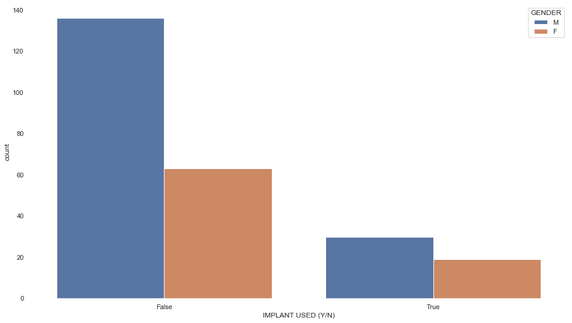
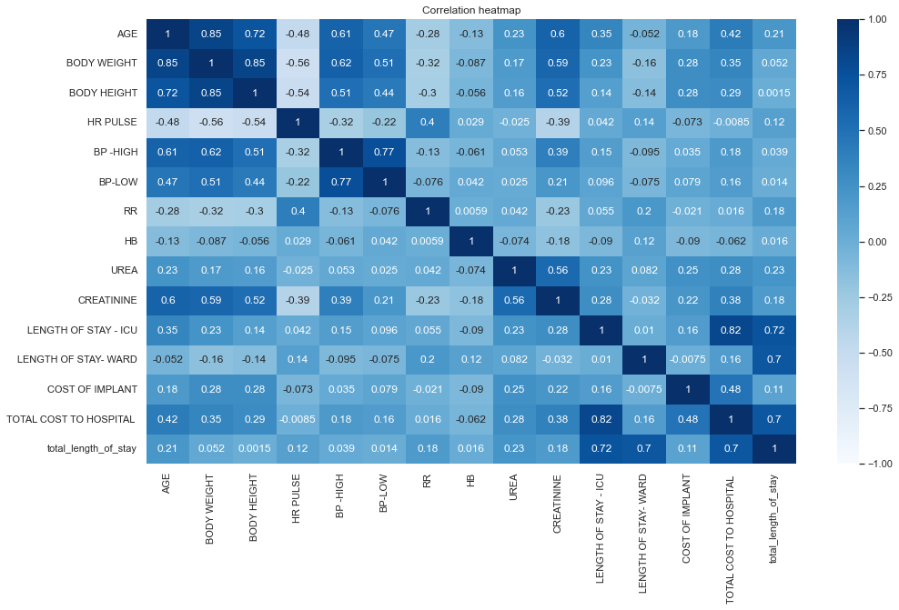
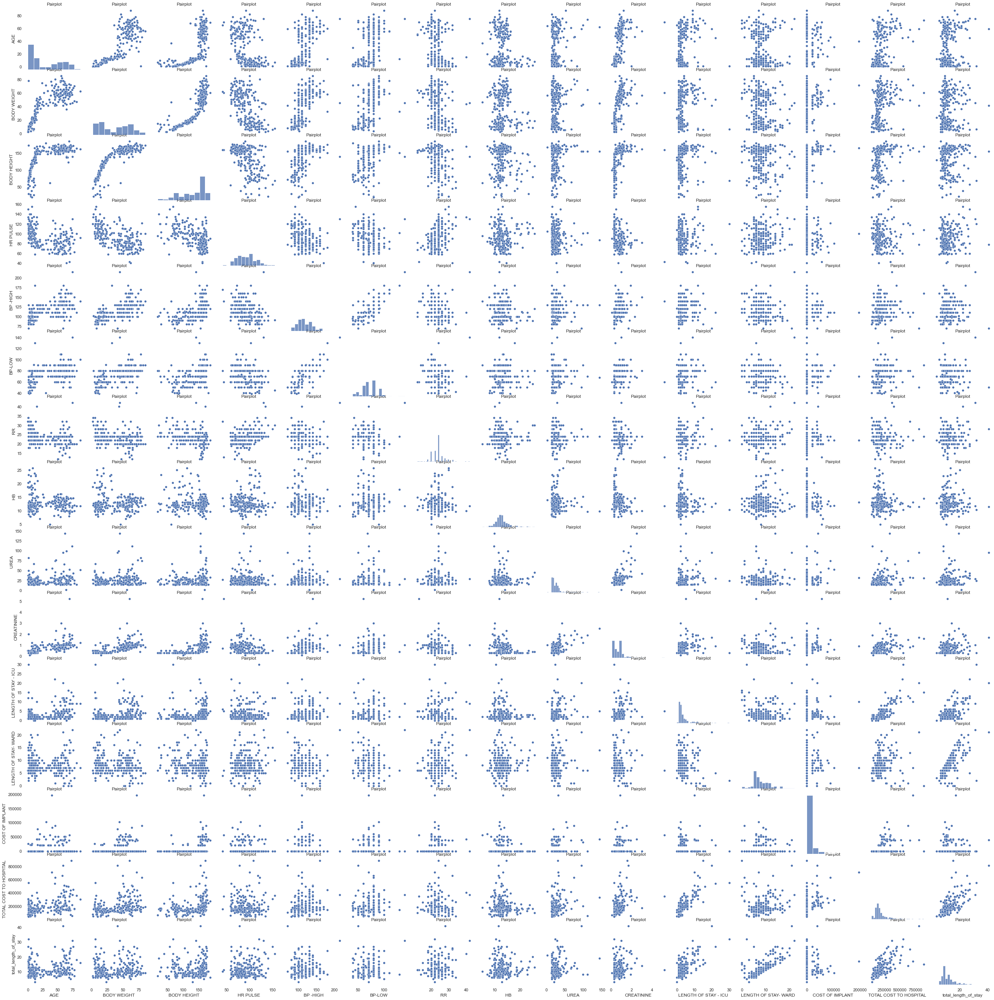
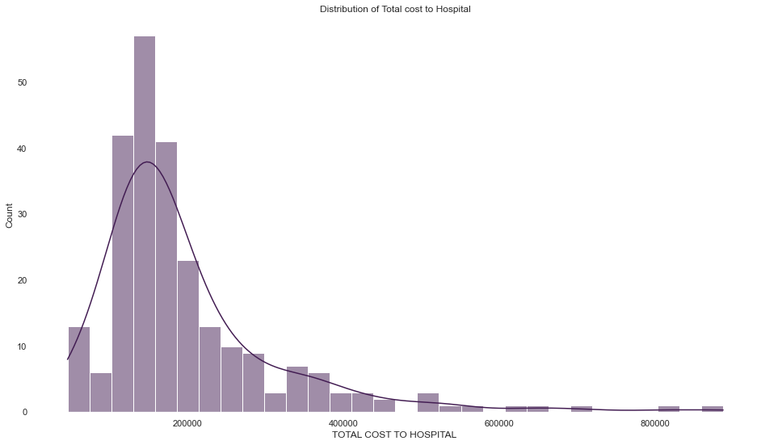
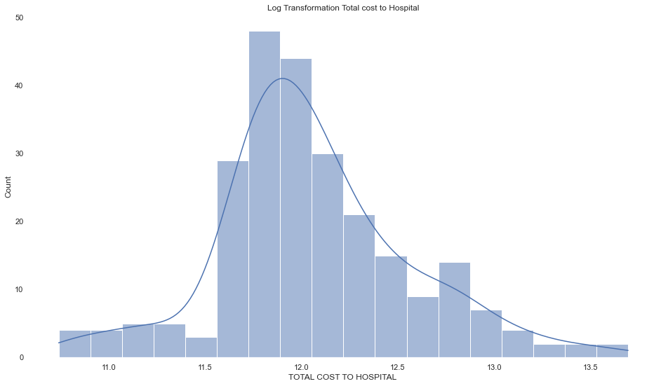
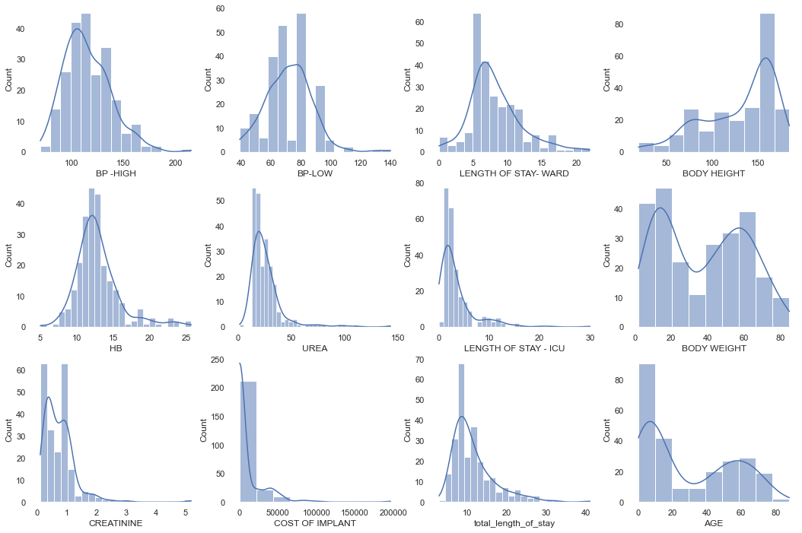
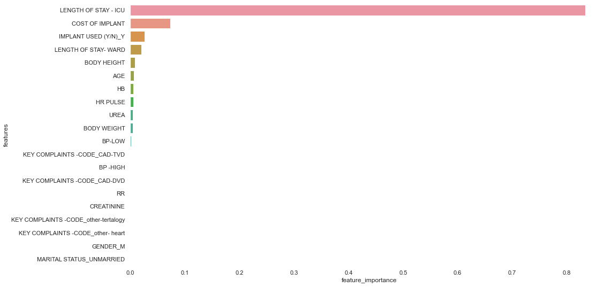

# Hospital Regression Analysis

In this notebook, I will go through my analysis with the goal of predicting the total cost to the hospital as a part of Dubai Future Foundation Case Study for a Business Intelligence Analyst.


## 1. Problem Definition

>How well can we predict the future cost to the hospital, given its characteristics and with previous examples of how much a similar treatment costed the hospital? 

## 2. Data

The data comes directly from Dubai Future Foundation.

There is one main datasets:

* Hospital-Data.xlsx - which contains the hospital patients details such as `gender`, `age`, `weight`, `blood pressure`, `implant`, and the `cost to the hospital`, and more.

#  Table of Contents

1. Data overview
2. Explanatory Data Analysis
3. Data-driven EDA and Feature Engineering
4. Data preparation for Regression Analysis
5. Regression Analysis
6. Machine Learning Algorithms
7. Conclusion


```python

```

## 1. Data overview

In this section:

- Import libraries
- See the statistics of the dataset
- Check for missing values 
- Drop the index


```python
#Importing libraries 
import numpy as np
import pandas as pd
import matplotlib.pyplot as plt
import seaborn as sns
import statsmodels.api as sm
from sklearn.model_selection import train_test_split
from sklearn.linear_model import LinearRegression
from sklearn.ensemble import RandomForestRegressor
from sklearn.metrics import mean_absolute_error, r2_score, mean_squared_error
from sklearn.model_selection import RandomizedSearchCV
from sklearn.preprocessing import StandardScaler
from sklearn.model_selection import cross_val_score
sns.set(rc={'figure.figsize':(16,9),'axes.facecolor':'white'})
```


```python
#Importing dataset and seeing an overview of the data
hospital = pd.read_excel('Hospital - Data.xlsx')
hospital.head()
```


<div>

<table border="1" class="dataframe">
  <thead>
    <tr style="text-align: right;">
      <th></th>
      <th>SL.</th>
      <th>AGE</th>
      <th>GENDER</th>
      <th>MARITAL STATUS</th>
      <th>KEY COMPLAINTS -CODE</th>
      <th>BODY WEIGHT</th>
      <th>BODY HEIGHT</th>
      <th>HR PULSE</th>
      <th>BP -HIGH</th>
      <th>BP-LOW</th>
      <th>...</th>
      <th>CREATININE</th>
      <th>MODE OF ARRIVAL</th>
      <th>STATE AT THE TIME OF ARRIVAL</th>
      <th>TYPE OF ADMSN</th>
      <th>TOTAL LENGTH OF STAY</th>
      <th>LENGTH OF STAY - ICU</th>
      <th>LENGTH OF STAY- WARD</th>
      <th>IMPLANT USED (Y/N)</th>
      <th>COST OF IMPLANT</th>
      <th>TOTAL COST TO HOSPITAL</th>
    </tr>
  </thead>
  <tbody>
    <tr>
      <th>0</th>
      <td>1</td>
      <td>58.0</td>
      <td>M</td>
      <td>MARRIED</td>
      <td>other- heart</td>
      <td>49.2</td>
      <td>160</td>
      <td>118</td>
      <td>100.0</td>
      <td>80.0</td>
      <td>...</td>
      <td>0.8</td>
      <td>AMBULANCE</td>
      <td>ALERT</td>
      <td>EMERGENCY</td>
      <td>25</td>
      <td>12</td>
      <td>13</td>
      <td>Y</td>
      <td>38000</td>
      <td>660293.0</td>
    </tr>
    <tr>
      <th>1</th>
      <td>2</td>
      <td>59.0</td>
      <td>M</td>
      <td>MARRIED</td>
      <td>CAD-DVD</td>
      <td>41.0</td>
      <td>155</td>
      <td>78</td>
      <td>70.0</td>
      <td>50.0</td>
      <td>...</td>
      <td>1.7</td>
      <td>AMBULANCE</td>
      <td>ALERT</td>
      <td>EMERGENCY</td>
      <td>41</td>
      <td>20</td>
      <td>21</td>
      <td>Y</td>
      <td>39690</td>
      <td>809130.0</td>
    </tr>
    <tr>
      <th>2</th>
      <td>3</td>
      <td>82.0</td>
      <td>M</td>
      <td>MARRIED</td>
      <td>CAD-TVD</td>
      <td>46.6</td>
      <td>164</td>
      <td>100</td>
      <td>110.0</td>
      <td>80.0</td>
      <td>...</td>
      <td>0.8</td>
      <td>WALKED IN</td>
      <td>ALERT</td>
      <td>ELECTIVE</td>
      <td>18</td>
      <td>9</td>
      <td>9</td>
      <td>N</td>
      <td>0</td>
      <td>362231.0</td>
    </tr>
    <tr>
      <th>3</th>
      <td>4</td>
      <td>46.0</td>
      <td>M</td>
      <td>MARRIED</td>
      <td>CAD-DVD</td>
      <td>80.0</td>
      <td>173</td>
      <td>122</td>
      <td>110.0</td>
      <td>80.0</td>
      <td>...</td>
      <td>1.5</td>
      <td>AMBULANCE</td>
      <td>ALERT</td>
      <td>EMERGENCY</td>
      <td>14</td>
      <td>13</td>
      <td>1</td>
      <td>Y</td>
      <td>89450</td>
      <td>629990.0</td>
    </tr>
    <tr>
      <th>4</th>
      <td>5</td>
      <td>60.0</td>
      <td>M</td>
      <td>MARRIED</td>
      <td>CAD-DVD</td>
      <td>58.0</td>
      <td>175</td>
      <td>72</td>
      <td>180.0</td>
      <td>100.0</td>
      <td>...</td>
      <td>1.9</td>
      <td>AMBULANCE</td>
      <td>ALERT</td>
      <td>EMERGENCY</td>
      <td>24</td>
      <td>12</td>
      <td>12</td>
      <td>N</td>
      <td>0</td>
      <td>444876.0</td>
    </tr>
  </tbody>
</table>
<p>5 rows × 24 columns</p>
</div>


```python
#Dropping the index column 
hospital = hospital.drop('SL.',axis=1)
```


```python
hospital.info()
```

    <class 'pandas.core.frame.DataFrame'>
    RangeIndex: 248 entries, 0 to 247
    Data columns (total 23 columns):
     #   Column                        Non-Null Count  Dtype  
    ---  ------                        --------------  -----  
     0   AGE                           248 non-null    float64
     1   GENDER                        248 non-null    object 
     2   MARITAL STATUS                248 non-null    object 
     3   KEY COMPLAINTS -CODE          212 non-null    object 
     4   BODY WEIGHT                   248 non-null    float64
     5   BODY HEIGHT                   248 non-null    int64  
     6   HR PULSE                      248 non-null    int64  
     7   BP -HIGH                      225 non-null    float64
     8   BP-LOW                        225 non-null    float64
     9   RR                            248 non-null    int64  
     10  PAST MEDICAL HISTORY CODE     75 non-null     object 
     11  HB                            246 non-null    float64
     12  UREA                          235 non-null    float64
     13  CREATININE                    215 non-null    float64
     14  MODE OF ARRIVAL               248 non-null    object 
     15  STATE AT THE TIME OF ARRIVAL  248 non-null    object 
     16  TYPE OF ADMSN                 248 non-null    object 
     17  TOTAL LENGTH OF STAY          248 non-null    int64  
     18  LENGTH OF STAY - ICU          248 non-null    int64  
     19  LENGTH OF STAY- WARD          248 non-null    int64  
     20  IMPLANT USED (Y/N)            248 non-null    object 
     21  COST OF IMPLANT               248 non-null    int64  
     22  TOTAL COST TO HOSPITAL        248 non-null    float64
    dtypes: float64(8), int64(7), object(8)
    memory usage: 44.7+ KB


```python
hospital.describe()
```


<div>

<table border="1" class="dataframe">
  <thead>
    <tr style="text-align: right;">
      <th></th>
      <th>AGE</th>
      <th>BODY WEIGHT</th>
      <th>BODY HEIGHT</th>
      <th>HR PULSE</th>
      <th>BP -HIGH</th>
      <th>BP-LOW</th>
      <th>RR</th>
      <th>HB</th>
      <th>UREA</th>
      <th>CREATININE</th>
      <th>TOTAL LENGTH OF STAY</th>
      <th>LENGTH OF STAY - ICU</th>
      <th>LENGTH OF STAY- WARD</th>
      <th>COST OF IMPLANT</th>
      <th>TOTAL COST TO HOSPITAL</th>
    </tr>
  </thead>
  <tbody>
    <tr>
      <th>count</th>
      <td>248.000000</td>
      <td>248.000000</td>
      <td>248.000000</td>
      <td>248.000000</td>
      <td>225.000000</td>
      <td>225.000000</td>
      <td>248.000000</td>
      <td>246.000000</td>
      <td>235.000000</td>
      <td>215.000000</td>
      <td>248.000000</td>
      <td>248.000000</td>
      <td>248.000000</td>
      <td>248.000000</td>
      <td>248.000000</td>
    </tr>
    <tr>
      <th>mean</th>
      <td>28.879837</td>
      <td>37.524677</td>
      <td>130.221774</td>
      <td>92.229839</td>
      <td>115.022222</td>
      <td>71.875556</td>
      <td>23.540323</td>
      <td>12.894553</td>
      <td>26.581702</td>
      <td>0.746977</td>
      <td>11.612903</td>
      <td>3.475806</td>
      <td>8.153226</td>
      <td>8544.201613</td>
      <td>198723.330282</td>
    </tr>
    <tr>
      <th>std</th>
      <td>25.899359</td>
      <td>23.118822</td>
      <td>39.170901</td>
      <td>20.308740</td>
      <td>22.536368</td>
      <td>15.313176</td>
      <td>3.840756</td>
      <td>3.083237</td>
      <td>15.998367</td>
      <td>0.548641</td>
      <td>5.392617</td>
      <td>3.853520</td>
      <td>3.755793</td>
      <td>21521.877503</td>
      <td>122587.492984</td>
    </tr>
    <tr>
      <th>min</th>
      <td>0.032877</td>
      <td>2.020000</td>
      <td>19.000000</td>
      <td>41.000000</td>
      <td>70.000000</td>
      <td>39.000000</td>
      <td>12.000000</td>
      <td>5.000000</td>
      <td>2.000000</td>
      <td>0.100000</td>
      <td>3.000000</td>
      <td>0.000000</td>
      <td>0.000000</td>
      <td>0.000000</td>
      <td>46093.000000</td>
    </tr>
    <tr>
      <th>25%</th>
      <td>6.000000</td>
      <td>15.000000</td>
      <td>105.000000</td>
      <td>78.000000</td>
      <td>100.000000</td>
      <td>60.000000</td>
      <td>22.000000</td>
      <td>11.300000</td>
      <td>18.000000</td>
      <td>0.300000</td>
      <td>8.000000</td>
      <td>1.000000</td>
      <td>6.000000</td>
      <td>0.000000</td>
      <td>131652.750000</td>
    </tr>
    <tr>
      <th>50%</th>
      <td>15.500000</td>
      <td>40.900000</td>
      <td>147.500000</td>
      <td>90.000000</td>
      <td>110.000000</td>
      <td>70.000000</td>
      <td>24.000000</td>
      <td>12.350000</td>
      <td>22.000000</td>
      <td>0.700000</td>
      <td>10.000000</td>
      <td>2.000000</td>
      <td>7.000000</td>
      <td>0.000000</td>
      <td>162660.500000</td>
    </tr>
    <tr>
      <th>75%</th>
      <td>55.000000</td>
      <td>58.250000</td>
      <td>160.000000</td>
      <td>104.000000</td>
      <td>130.000000</td>
      <td>80.000000</td>
      <td>24.000000</td>
      <td>14.000000</td>
      <td>30.000000</td>
      <td>1.000000</td>
      <td>13.000000</td>
      <td>4.000000</td>
      <td>10.000000</td>
      <td>0.000000</td>
      <td>220614.000000</td>
    </tr>
    <tr>
      <th>max</th>
      <td>88.000000</td>
      <td>85.000000</td>
      <td>185.000000</td>
      <td>155.000000</td>
      <td>215.000000</td>
      <td>140.000000</td>
      <td>42.000000</td>
      <td>25.700000</td>
      <td>143.000000</td>
      <td>5.200000</td>
      <td>41.000000</td>
      <td>30.000000</td>
      <td>22.000000</td>
      <td>196848.000000</td>
      <td>887350.000000</td>
    </tr>
  </tbody>
</table>
</div>


## 2. Explanatory Data Analysis (EDA)

In this section:

- Perform explanatory data analysis
- Look for correlations in the data


```python
sns.countplot(hue= hospital['GENDER'], x= hospital['IMPLANT USED (Y/N)'] == 'Y' )
```


    <AxesSubplot:xlabel='IMPLANT USED (Y/N)', ylabel='count'>


    

    


```python
hospital.GENDER.value_counts()
```


    M    166
    F     82
    Name: GENDER, dtype: int64


```python
hospital['IMPLANT USED (Y/N)'].value_counts()
```


    N    199
    Y     49
    Name: IMPLANT USED (Y/N), dtype: int64


```python
# Check whether total length of stay is actually equal to the length of stay ICU + WARD
hospital['TOTAL LENGTH OF STAY'].sum(), hospital['LENGTH OF STAY - ICU'].sum() \
+ hospital['LENGTH OF STAY- WARD'].sum()
```


    (2880, 2884)


```python
#There seems to a discrepency of 4 days between the summation of ICU + WARD and TOTAL Length of stay
#We will create a new column and investigate
hospital['total_length_of_stay'] = hospital['LENGTH OF STAY - ICU'] + hospital['LENGTH OF STAY- WARD']
```


```python
#To see all the rows with discrepencies
hospital[hospital['total_length_of_stay']!= hospital['TOTAL LENGTH OF STAY']][['total_length_of_stay',
                                                                               'TOTAL LENGTH OF STAY',
                                                                               'LENGTH OF STAY- WARD',
                                                                              'LENGTH OF STAY - ICU']]
```


<div>

<table border="1" class="dataframe">
  <thead>
    <tr style="text-align: right;">
      <th></th>
      <th>total_length_of_stay</th>
      <th>TOTAL LENGTH OF STAY</th>
      <th>LENGTH OF STAY- WARD</th>
      <th>LENGTH OF STAY - ICU</th>
    </tr>
  </thead>
  <tbody>
    <tr>
      <th>15</th>
      <td>7</td>
      <td>9</td>
      <td>3</td>
      <td>4</td>
    </tr>
    <tr>
      <th>27</th>
      <td>16</td>
      <td>15</td>
      <td>10</td>
      <td>6</td>
    </tr>
    <tr>
      <th>141</th>
      <td>8</td>
      <td>7</td>
      <td>6</td>
      <td>2</td>
    </tr>
    <tr>
      <th>161</th>
      <td>26</td>
      <td>25</td>
      <td>20</td>
      <td>6</td>
    </tr>
    <tr>
      <th>163</th>
      <td>13</td>
      <td>12</td>
      <td>10</td>
      <td>3</td>
    </tr>
    <tr>
      <th>164</th>
      <td>13</td>
      <td>12</td>
      <td>12</td>
      <td>1</td>
    </tr>
    <tr>
      <th>167</th>
      <td>11</td>
      <td>10</td>
      <td>9</td>
      <td>2</td>
    </tr>
  </tbody>
</table>
</div>


```python
# Dropping total length of stay
hospital.drop('TOTAL LENGTH OF STAY',axis=1, inplace=True)
```


```python
#Lets create a heatmap to see whether there are any correlations
sns.heatmap(hospital.corr(), vmin=-1, vmax=1, annot=True, cmap='Blues').set(title= 'Correlation heatmap')
```


    [Text(0.5, 1.0, 'Correlation heatmap')]


    

    


```python
# Lets create a pairplot to see if we can find anything interesting
sns.pairplot(hospital).set(title= 'Pairplot')
```


    <seaborn.axisgrid.PairGrid at 0x147c19c70>


    

    


### Key Takeaways
**Length of stay:**
- The sum of 'Length of stay' of ward + ICU != TOTAL LENGTH OF STAY
- Created a new column
- Dropped the old column

**Correlation Matrix:**
- Length of stay - ICU has a very high correlation on the Total Cost, 82%
- Followed by cost of implant and age, 48% and 42%, respectively

-**Other takeaways:**
- 67% of the samples are men
- 19% of the samples already have implants
- As age increases, bodyweight increases, bodyheight increases, HR pulse decreases

**Pairplot:**
- Theres a positive linear relationship between Cost and Stay

## 3. Data-Driven EDA and Feature engineering

The data-driven exploratory data analysis will include:

- Dealing with the distribution of the data, check the `Skewness` and `Kurtosis`
- Dealing with missing data
- Develop a strategy for the analysis

>**Skewness** refers to a distortion or asymmetry that deviates from the symmetrical bell curve, or normal distribution, in a set of data.

>**Kurtosis** the sharpness of the peak of a frequency-distribution curve.
- acceptable ranges for Skewness and Kurtosis to assume a `Normal Distribution` = *-1.5 to 1.5*


```python
#Create a histplot for the dependent variable to see the distribution
sns.histplot(hospital['TOTAL COST TO HOSPITAL '],kde=True, color="#421C52").set(title='Distribution of Total cost to Hospital')
```


    [Text(0.5, 1.0, 'Distribution of Total cost to Hospital')]


    

    


```python
#To check the Skewness and Kurtosis of the Target Variable
print("Skewness: %f" % hospital['TOTAL COST TO HOSPITAL '].skew())
print("Kurtosis: %f" % hospital['TOTAL COST TO HOSPITAL '].kurt())
```

    Skewness: 2.455584
    Kurtosis: 8.087163


### Key Takeaways
- Deviates from the normal distribution
- Have appreciable positive skewness of 2.45
- Shows peakedness and kurtosis of 8.09

The Skewness and Kurtosis are both above the range of -1.5 to 1.5

**Strategy:** 
- log transformation

**Log transformation** The Log Transformation is used to transform skewed datasets to achieve linearity (near-normal distribution)


```python
# Create a histogram for log transformed Y 
sns.histplot(np.log(hospital['TOTAL COST TO HOSPITAL ']),kde=True).set(title='Log Transformation Total cost to Hospital')
```


    [Text(0.5, 1.0, 'Log Transformation Total cost to Hospital')]


    

    


```python
# To check the skewness and kurtosis of the log transformed target variable
print("Skewness: %f" % np.log(hospital['TOTAL COST TO HOSPITAL ']).skew())
print("Kurtosis: %f" % np.log(hospital['TOTAL COST TO HOSPITAL ']).kurt())
```

    Skewness: 0.395575
    Kurtosis: 0.921752


### Key Takeaways
- The log transformation was effective and now assumes a normal distribution
- Skewness and Kurtosis both in ranges of -1.5 to 1.5

Now to see the distribution of the features


```python
# Creates histogram subplots to see the skewness of the features
fig, axs = plt.subplots(3, 4, figsize=(18, 12))
sns.histplot(hospital['BP -HIGH'], kde= True, ax=axs[0, 0],)
sns.histplot(hospital['BP-LOW'], kde= True, ax=axs[0, 1])
sns.histplot(hospital['HB'], kde= True, ax=axs[1, 0])
sns.histplot(hospital['UREA'], kde= True, ax=axs[1, 1])
sns.histplot(hospital['CREATININE'], kde= True, ax=axs[2, 0])
sns.histplot(hospital['COST OF IMPLANT'], kde= True, ax=axs[2, 1])
sns.histplot(hospital['LENGTH OF STAY- WARD'], kde= True, ax=axs[0, 2])
sns.histplot(hospital['LENGTH OF STAY - ICU'], kde= True, ax=axs[1, 2])
sns.histplot(hospital['total_length_of_stay'], kde= True, ax=axs[2, 2])
sns.histplot(hospital['BODY HEIGHT'],kde=True, ax=axs[0, 3])
sns.histplot(hospital['BODY WEIGHT'],kde=True, ax=axs[1, 3])
sns.histplot(hospital['AGE'],kde=True, ax=axs[2, 3])
plt.show()
```


    

    


### Key Takeaways

From the distribution of features we can observe: 
- BP high and Low seem to be at normal ranges with the exception of a few cases, avg 120/80
- Body height seems to be normal, international avg according to WHO is 160 cm for women and 170 cm for men
- Hemoglobin count seems to be normal, ~14 – 18 g/dL for men and 12 – 15 g/dL for women
- Age, as there seem to be a lot of kids, hence the skewness 
- Creatinine and Urea, 0.6 – 1.3 mg/dL and 6 – 24 mg/dL 

**Strategy:** 
- Deal with missing values first,

{Optional}
- Check the skewness and kurtosis,
- Log transform anything that violates the skewness and kurtosis range

**Note:** Log transformation does not work for 0 or negative integers


```python
# Finding the missing numerical and categorical values
missing_numerical = [var for var in hospital.columns if hospital[var].isnull().mean()> 0 
                     and hospital[var].dtypes != 'O']
missing_categorical = [var for var in hospital.columns if hospital[var].isnull().mean()> 0 
                     and hospital[var].dtypes == 'O']
print(f'missing_numerical: {missing_numerical},\nmissing_categorical: {missing_categorical}')
```

    missing_numerical: ['BP -HIGH', 'BP-LOW', 'HB', 'UREA', 'CREATININE'],
    missing_categorical: ['KEY COMPLAINTS -CODE', 'PAST MEDICAL HISTORY CODE']


```python
# fill numeric rows with Median
for label, content in hospital.items():
    if pd.api.types.is_numeric_dtype(content):
        if pd.isnull(content).sum():
            #Filling missing numeric with Median
            hospital[label] = content.fillna(content.median())
```

**Note:** As our data contains outliers, Median is not affected by outliers

e.g. 5 people with the following salaries - 10, 10, 10, 10, 1000

- mean - 208
- median - 10


```python
# fill categorical rows
# As there are only few NA's in the KEY COMPLAINTS -CODE column, we can fill the missing rows with OTHER
hospital['KEY COMPLAINTS -CODE'].fillna('OTHER', inplace=True)

#Since PAST MEDICAL HISTORY CODE column has more than 50% NA's, I will drop the column
hospital = hospital.drop('PAST MEDICAL HISTORY CODE',axis=1)
```


```python
# Finding the missing numerical and categorical values
missing_numerical = [var for var in hospital.columns if hospital[var].isnull().mean()> 0 
                     and hospital[var].dtypes != 'O']
missing_categorical = [var for var in hospital.columns if hospital[var].isnull().mean()> 0 
                     and hospital[var].dtypes == 'O']
print(f'missing_numerical: {missing_numerical},\nmissing_categorical: {missing_categorical}')
```

    missing_numerical: [],
    missing_categorical: []


```python
# Creating a dataframe of ints and floats
df1 = hospital.select_dtypes([int, float])
# for i, col in enumerate(df1.columns):
#     plt.figure(i)
#     sns.histplot(x=col, data=df1, kde=True)
```


```python
for label, col in enumerate(df1):
    print(label,"Skewness: %f" % df1[col].skew())
    print(label,"Kurtosis: %f" % df1[col].kurt())
```

    0 Skewness: 0.466891
    0 Kurtosis: -1.372924
    1 Skewness: 0.127305
    1 Kurtosis: -1.392069
    2 Skewness: -0.885674
    2 Kurtosis: -0.251092
    3 Skewness: 0.330071
    3 Kurtosis: -0.199543
    4 Skewness: 0.937604
    4 Kurtosis: 1.782032
    5 Skewness: 0.531453
    5 Kurtosis: 2.269801
    6 Skewness: 0.760499
    6 Kurtosis: 3.747282
    7 Skewness: 1.504747
    7 Kurtosis: 3.637184
    8 Skewness: 3.744536
    8 Kurtosis: 19.172017
    9 Skewness: 3.613607
    9 Kurtosis: 24.667259
    10 Skewness: 2.997234
    10 Kurtosis: 12.381168
    11 Skewness: 0.960647
    11 Kurtosis: 1.615304
    12 Skewness: 4.119912
    12 Kurtosis: 25.728311
    13 Skewness: 2.455584
    13 Kurtosis: 8.087163
    14 Skewness: 1.844533
    14 Kurtosis: 4.599267


```python
mydict = {}
for k,v in enumerate(df1.columns):
    mydict[k] = v
print(mydict)
```

    {0: 'AGE', 1: 'BODY WEIGHT', 2: 'BODY HEIGHT', 3: 'HR PULSE', 4: 'BP -HIGH', 5: 'BP-LOW', 6: 'RR', 7: 'HB', 8: 'UREA', 9: 'CREATININE', 10: 'LENGTH OF STAY - ICU', 11: 'LENGTH OF STAY- WARD', 12: 'COST OF IMPLANT', 13: 'TOTAL COST TO HOSPITAL ', 14: 'total_length_of_stay'}


```python
#Transform UREA, CREATININE, LENGTH OF STAY - ICU, LENGTH OF STAY - WARD, total_length_of_stay
hospital_transformed = hospital.drop(['CREATININE', 'UREA'],axis=1)
df2 = np.log(df1[['UREA', 'CREATININE']])
hospital_transformed = pd.concat([hospital_transformed, df2],axis=1)
#The length of stay icu, ward, and total stay all had zero values, hence could not be transformed
```

## 4. Data preparation for Regression Analysis

Tasks for this section, 

- Create subsets of the data for the analysis (X and Y)
- Dummy variables/ One hot encoding

**Subsets:**
- Subset 1: Dropped target variable and extra dummy variables to avoid multicollinearity
- Subset 2: Log-transformed variables
- Subset 3: Scaled variables (although scaling does not matter in linear regression) 

**Multicollinearity:** Multicollinearity occurs when two or more independent variables are highly correlated with one another in a regression model.


```python
# Using dummy variables to transform the categorical columns
hospital_dummy = pd.get_dummies(hospital)
hospital_dummy_transformed = pd.get_dummies(hospital_transformed)
```


```python
#Subset 1: Dropped target variable and extra dummy variables to avoid multicollinearity
X = hospital_dummy.drop(['GENDER_F','MARITAL STATUS_MARRIED','KEY COMPLAINTS -CODE_OTHER',
                    'TOTAL COST TO HOSPITAL ','MODE OF ARRIVAL_WALKED IN',
                   'TYPE OF ADMSN_EMERGENCY', 'IMPLANT USED (Y/N)_N','total_length_of_stay'], axis=1)
y = hospital_dummy['TOTAL COST TO HOSPITAL ']
```


```python
#Subset 2: log-transformed variables
X_transformed = hospital_dummy_transformed.drop(['GENDER_F','MARITAL STATUS_MARRIED',
                                                 'KEY COMPLAINTS -CODE_OTHER',
                    'TOTAL COST TO HOSPITAL ','MODE OF ARRIVAL_WALKED IN',
                   'TYPE OF ADMSN_EMERGENCY', 'IMPLANT USED (Y/N)_N','total_length_of_stay'], axis=1)
y_transformed = np.log(hospital_dummy_transformed['TOTAL COST TO HOSPITAL '])
```


```python
#Subset 3: scaled 
X_scaled = StandardScaler().fit_transform(X)
```

## 5. Regression Analysis

In this section: 
- Perform regression analysis using Linear Regression
- Creating a B0 constant 

**Models:**
1. Model 1: Nothing log-transformed
2. Model 2: Log-transformed features and dependent variable
3. Model 3: Only log transformed dependent variable with untransformed features
4. Model 4: Same as model 1 but with scaled variables


Where Y is the dependent variable, B0 is the constant, X(n) is the feature, B(n) is the slope of the feature.


```python
# adding a constant B0 to the X
X_cons = sm.add_constant(X)
X_transformed_cons = sm.add_constant(X_transformed)
X_scaled_cons = sm.add_constant(X_scaled)
```


```python

```


```python
#Model 1
model_1 = sm.OLS(y, X_cons).fit()
model_1.summary()
```


<table class="simpletable">
<caption>OLS Regression Results</caption>
<tr>
  <th>Dep. Variable:</th>    <td>TOTAL COST TO HOSPITAL </td> <th>  R-squared:         </th> <td>   0.871</td>
</tr>
<tr>
  <th>Model:</th>                      <td>OLS</td>           <th>  Adj. R-squared:    </th> <td>   0.851</td>
</tr>
<tr>
  <th>Method:</th>                <td>Least Squares</td>      <th>  F-statistic:       </th> <td>   43.90</td>
</tr>
<tr>
  <th>Date:</th>                <td>Fri, 24 Jun 2022</td>     <th>  Prob (F-statistic):</th> <td>1.10e-77</td>
</tr>
<tr>
  <th>Time:</th>                    <td>01:23:40</td>         <th>  Log-Likelihood:    </th> <td> -3002.9</td>
</tr>
<tr>
  <th>No. Observations:</th>         <td>   248</td>          <th>  AIC:               </th> <td>   6074.</td>
</tr>
<tr>
  <th>Df Residuals:</th>             <td>   214</td>          <th>  BIC:               </th> <td>   6193.</td>
</tr>
<tr>
  <th>Df Model:</th>                 <td>    33</td>          <th>                     </th>     <td> </td>   
</tr>
<tr>
  <th>Covariance Type:</th>         <td>nonrobust</td>        <th>                     </th>     <td> </td>   
</tr>
</table>
<table class="simpletable">
<tr>
                     <td></td>                        <th>coef</th>     <th>std err</th>      <th>t</th>      <th>P>|t|</th>  <th>[0.025</th>    <th>0.975]</th>  
</tr>
<tr>
  <th>const</th>                                   <td>-1.257e+05</td> <td> 4.44e+04</td> <td>   -2.831</td> <td> 0.005</td> <td>-2.13e+05</td> <td>-3.82e+04</td>
</tr>
<tr>
  <th>AGE</th>                                     <td>  291.2891</td> <td>  337.717</td> <td>    0.863</td> <td> 0.389</td> <td> -374.389</td> <td>  956.967</td>
</tr>
<tr>
  <th>BODY WEIGHT</th>                             <td> -578.4075</td> <td>  409.043</td> <td>   -1.414</td> <td> 0.159</td> <td>-1384.676</td> <td>  227.861</td>
</tr>
<tr>
  <th>BODY HEIGHT</th>                             <td>  377.1939</td> <td>  165.719</td> <td>    2.276</td> <td> 0.024</td> <td>   50.544</td> <td>  703.844</td>
</tr>
<tr>
  <th>HR PULSE</th>                                <td>  360.9545</td> <td>  203.460</td> <td>    1.774</td> <td> 0.077</td> <td>  -40.089</td> <td>  761.998</td>
</tr>
<tr>
  <th>BP -HIGH</th>                                <td>   53.7237</td> <td>  260.592</td> <td>    0.206</td> <td> 0.837</td> <td> -459.932</td> <td>  567.380</td>
</tr>
<tr>
  <th>BP-LOW</th>                                  <td>   75.2708</td> <td>  344.591</td> <td>    0.218</td> <td> 0.827</td> <td> -603.957</td> <td>  754.499</td>
</tr>
<tr>
  <th>RR</th>                                      <td> -283.7234</td> <td>  954.041</td> <td>   -0.297</td> <td> 0.766</td> <td>-2164.244</td> <td> 1596.797</td>
</tr>
<tr>
  <th>HB</th>                                      <td>  466.7689</td> <td> 1146.144</td> <td>    0.407</td> <td> 0.684</td> <td>-1792.409</td> <td> 2725.947</td>
</tr>
<tr>
  <th>UREA</th>                                    <td> -574.6697</td> <td>  290.170</td> <td>   -1.980</td> <td> 0.049</td> <td>-1146.628</td> <td>   -2.712</td>
</tr>
<tr>
  <th>CREATININE</th>                              <td> 4.516e+04</td> <td> 1.32e+04</td> <td>    3.431</td> <td> 0.001</td> <td> 1.92e+04</td> <td> 7.11e+04</td>
</tr>
<tr>
  <th>LENGTH OF STAY - ICU</th>                    <td>  2.21e+04</td> <td>  989.123</td> <td>   22.342</td> <td> 0.000</td> <td> 2.01e+04</td> <td>  2.4e+04</td>
</tr>
<tr>
  <th>LENGTH OF STAY- WARD</th>                    <td> 5269.2340</td> <td>  896.635</td> <td>    5.877</td> <td> 0.000</td> <td> 3501.867</td> <td> 7036.602</td>
</tr>
<tr>
  <th>COST OF IMPLANT</th>                         <td>    2.0283</td> <td>    0.254</td> <td>    7.992</td> <td> 0.000</td> <td>    1.528</td> <td>    2.529</td>
</tr>
<tr>
  <th>GENDER_M</th>                                <td>-3587.9102</td> <td> 7130.129</td> <td>   -0.503</td> <td> 0.615</td> <td>-1.76e+04</td> <td> 1.05e+04</td>
</tr>
<tr>
  <th>MARITAL STATUS_UNMARRIED</th>                <td> 4419.5481</td> <td> 1.56e+04</td> <td>    0.284</td> <td> 0.777</td> <td>-2.63e+04</td> <td> 3.51e+04</td>
</tr>
<tr>
  <th>KEY COMPLAINTS -CODE_ACHD</th>               <td> 8698.5865</td> <td> 1.51e+04</td> <td>    0.576</td> <td> 0.565</td> <td>-2.11e+04</td> <td> 3.85e+04</td>
</tr>
<tr>
  <th>KEY COMPLAINTS -CODE_CAD-DVD</th>            <td> 2.919e+04</td> <td>  1.4e+04</td> <td>    2.090</td> <td> 0.038</td> <td> 1656.481</td> <td> 5.67e+04</td>
</tr>
<tr>
  <th>KEY COMPLAINTS -CODE_CAD-SVD</th>            <td> 3.627e+04</td> <td> 3.64e+04</td> <td>    0.998</td> <td> 0.320</td> <td>-3.54e+04</td> <td> 1.08e+05</td>
</tr>
<tr>
  <th>KEY COMPLAINTS -CODE_CAD-TVD</th>            <td> 4.649e+04</td> <td> 1.42e+04</td> <td>    3.270</td> <td> 0.001</td> <td> 1.85e+04</td> <td> 7.45e+04</td>
</tr>
<tr>
  <th>KEY COMPLAINTS -CODE_CAD-VSD</th>            <td> 4.098e+04</td> <td> 4.93e+04</td> <td>    0.832</td> <td> 0.406</td> <td>-5.61e+04</td> <td> 1.38e+05</td>
</tr>
<tr>
  <th>KEY COMPLAINTS -CODE_OS-ASD</th>             <td> 2.115e+04</td> <td> 1.57e+04</td> <td>    1.349</td> <td> 0.179</td> <td>-9752.185</td> <td> 5.21e+04</td>
</tr>
<tr>
  <th>KEY COMPLAINTS -CODE_PM-VSD</th>             <td> 4.734e+04</td> <td> 2.36e+04</td> <td>    2.009</td> <td> 0.046</td> <td>  903.043</td> <td> 9.38e+04</td>
</tr>
<tr>
  <th>KEY COMPLAINTS -CODE_RHD</th>                <td>-8416.5214</td> <td> 1.71e+04</td> <td>   -0.492</td> <td> 0.623</td> <td>-4.22e+04</td> <td> 2.53e+04</td>
</tr>
<tr>
  <th>KEY COMPLAINTS -CODE_other- heart</th>       <td> 6782.9036</td> <td> 1.22e+04</td> <td>    0.555</td> <td> 0.580</td> <td>-1.73e+04</td> <td> 3.09e+04</td>
</tr>
<tr>
  <th>KEY COMPLAINTS -CODE_other- respiratory</th> <td> 9210.6860</td> <td> 1.61e+04</td> <td>    0.574</td> <td> 0.567</td> <td>-2.24e+04</td> <td> 4.08e+04</td>
</tr>
<tr>
  <th>KEY COMPLAINTS -CODE_other-general</th>      <td>-6.953e+04</td> <td> 5.34e+04</td> <td>   -1.302</td> <td> 0.194</td> <td>-1.75e+05</td> <td> 3.57e+04</td>
</tr>
<tr>
  <th>KEY COMPLAINTS -CODE_other-nervous</th>      <td> 8261.8948</td> <td> 3.03e+04</td> <td>    0.272</td> <td> 0.786</td> <td>-5.16e+04</td> <td> 6.81e+04</td>
</tr>
<tr>
  <th>KEY COMPLAINTS -CODE_other-tertalogy</th>    <td> 3.935e+04</td> <td> 1.64e+04</td> <td>    2.401</td> <td> 0.017</td> <td> 7052.029</td> <td> 7.16e+04</td>
</tr>
<tr>
  <th>MODE OF ARRIVAL_AMBULANCE</th>               <td> 4.826e+04</td> <td> 3.68e+04</td> <td>    1.311</td> <td> 0.191</td> <td>-2.43e+04</td> <td> 1.21e+05</td>
</tr>
<tr>
  <th>MODE OF ARRIVAL_TRANSFERRED</th>             <td> -2.76e+04</td> <td> 2.53e+04</td> <td>   -1.091</td> <td> 0.277</td> <td>-7.75e+04</td> <td> 2.23e+04</td>
</tr>
<tr>
  <th>STATE AT THE TIME OF ARRIVAL_ALERT</th>      <td> 1.899e+04</td> <td> 3.07e+04</td> <td>    0.618</td> <td> 0.537</td> <td>-4.16e+04</td> <td> 7.96e+04</td>
</tr>
<tr>
  <th>STATE AT THE TIME OF ARRIVAL_CONFUSED</th>   <td>-1.447e+05</td> <td> 5.45e+04</td> <td>   -2.656</td> <td> 0.008</td> <td>-2.52e+05</td> <td>-3.73e+04</td>
</tr>
<tr>
  <th>TYPE OF ADMSN_ELECTIVE</th>                  <td> 5.413e+04</td> <td> 3.58e+04</td> <td>    1.510</td> <td> 0.132</td> <td>-1.65e+04</td> <td> 1.25e+05</td>
</tr>
<tr>
  <th>IMPLANT USED (Y/N)_Y</th>                    <td>   1.5e+04</td> <td> 1.48e+04</td> <td>    1.014</td> <td> 0.312</td> <td>-1.42e+04</td> <td> 4.42e+04</td>
</tr>
</table>
<table class="simpletable">
<tr>
  <th>Omnibus:</th>       <td>226.677</td> <th>  Durbin-Watson:     </th> <td>   1.903</td>
</tr>
<tr>
  <th>Prob(Omnibus):</th> <td> 0.000</td>  <th>  Jarque-Bera (JB):  </th> <td>9380.922</td>
</tr>
<tr>
  <th>Skew:</th>          <td> 3.315</td>  <th>  Prob(JB):          </th> <td>    0.00</td>
</tr>
<tr>
  <th>Kurtosis:</th>      <td>32.392</td>  <th>  Cond. No.          </th> <td>3.70e+15</td>
</tr>
</table><br/><br/>Notes:<br/>[1] Standard Errors assume that the covariance matrix of the errors is correctly specified.<br/>[2] The smallest eigenvalue is 9.67e-21. This might indicate that there are<br/>strong multicollinearity problems or that the design matrix is singular.


```python
X_cons = X_cons.drop('LENGTH OF STAY - ICU',axis=1)
```


```python
#Model 1
model_1 = sm.OLS(y, X_cons).fit()
model_1.summary()
```


<table class="simpletable">
<caption>OLS Regression Results</caption>
<tr>
  <th>Dep. Variable:</th>    <td>TOTAL COST TO HOSPITAL </td> <th>  R-squared:         </th> <td>   0.571</td>
</tr>
<tr>
  <th>Model:</th>                      <td>OLS</td>           <th>  Adj. R-squared:    </th> <td>   0.507</td>
</tr>
<tr>
  <th>Method:</th>                <td>Least Squares</td>      <th>  F-statistic:       </th> <td>   8.946</td>
</tr>
<tr>
  <th>Date:</th>                <td>Fri, 24 Jun 2022</td>     <th>  Prob (F-statistic):</th> <td>4.95e-25</td>
</tr>
<tr>
  <th>Time:</th>                    <td>01:23:40</td>         <th>  Log-Likelihood:    </th> <td> -3152.1</td>
</tr>
<tr>
  <th>No. Observations:</th>         <td>   248</td>          <th>  AIC:               </th> <td>   6370.</td>
</tr>
<tr>
  <th>Df Residuals:</th>             <td>   215</td>          <th>  BIC:               </th> <td>   6486.</td>
</tr>
<tr>
  <th>Df Model:</th>                 <td>    32</td>          <th>                     </th>     <td> </td>   
</tr>
<tr>
  <th>Covariance Type:</th>         <td>nonrobust</td>        <th>                     </th>     <td> </td>   
</tr>
</table>
<table class="simpletable">
<tr>
                     <td></td>                        <th>coef</th>     <th>std err</th>      <th>t</th>      <th>P>|t|</th>  <th>[0.025</th>    <th>0.975]</th>  
</tr>
<tr>
  <th>const</th>                                   <td>-1.712e+05</td> <td> 8.08e+04</td> <td>   -2.118</td> <td> 0.035</td> <td> -3.3e+05</td> <td>-1.19e+04</td>
</tr>
<tr>
  <th>AGE</th>                                     <td> 1615.2266</td> <td>  605.529</td> <td>    2.667</td> <td> 0.008</td> <td>  421.692</td> <td> 2808.761</td>
</tr>
<tr>
  <th>BODY WEIGHT</th>                             <td> -619.9858</td> <td>  744.967</td> <td>   -0.832</td> <td> 0.406</td> <td>-2088.360</td> <td>  848.388</td>
</tr>
<tr>
  <th>BODY HEIGHT</th>                             <td>  144.4495</td> <td>  301.220</td> <td>    0.480</td> <td> 0.632</td> <td> -449.273</td> <td>  738.172</td>
</tr>
<tr>
  <th>HR PULSE</th>                                <td> 1188.8854</td> <td>  364.357</td> <td>    3.263</td> <td> 0.001</td> <td>  470.716</td> <td> 1907.055</td>
</tr>
<tr>
  <th>BP -HIGH</th>                                <td>  152.8068</td> <td>  474.538</td> <td>    0.322</td> <td> 0.748</td> <td> -782.536</td> <td> 1088.149</td>
</tr>
<tr>
  <th>BP-LOW</th>                                  <td> -713.0041</td> <td>  624.293</td> <td>   -1.142</td> <td> 0.255</td> <td>-1943.523</td> <td>  517.515</td>
</tr>
<tr>
  <th>RR</th>                                      <td> 1887.8378</td> <td> 1728.519</td> <td>    1.092</td> <td> 0.276</td> <td>-1519.174</td> <td> 5294.850</td>
</tr>
<tr>
  <th>HB</th>                                      <td> -709.1288</td> <td> 2085.229</td> <td>   -0.340</td> <td> 0.734</td> <td>-4819.238</td> <td> 3400.981</td>
</tr>
<tr>
  <th>UREA</th>                                    <td> -240.9863</td> <td>  527.776</td> <td>   -0.457</td> <td> 0.648</td> <td>-1281.265</td> <td>  799.292</td>
</tr>
<tr>
  <th>CREATININE</th>                              <td> 6.237e+04</td> <td> 2.39e+04</td> <td>    2.606</td> <td> 0.010</td> <td> 1.52e+04</td> <td>  1.1e+05</td>
</tr>
<tr>
  <th>LENGTH OF STAY- WARD</th>                    <td> 4038.8069</td> <td> 1629.925</td> <td>    2.478</td> <td> 0.014</td> <td>  826.128</td> <td> 7251.486</td>
</tr>
<tr>
  <th>COST OF IMPLANT</th>                         <td>    2.3878</td> <td>    0.461</td> <td>    5.176</td> <td> 0.000</td> <td>    1.479</td> <td>    3.297</td>
</tr>
<tr>
  <th>GENDER_M</th>                                <td>  589.6190</td> <td>  1.3e+04</td> <td>    0.045</td> <td> 0.964</td> <td> -2.5e+04</td> <td> 2.62e+04</td>
</tr>
<tr>
  <th>MARITAL STATUS_UNMARRIED</th>                <td>  3.09e+04</td> <td> 2.83e+04</td> <td>    1.093</td> <td> 0.275</td> <td>-2.48e+04</td> <td> 8.66e+04</td>
</tr>
<tr>
  <th>KEY COMPLAINTS -CODE_ACHD</th>               <td>-9255.8883</td> <td> 2.75e+04</td> <td>   -0.337</td> <td> 0.737</td> <td>-6.34e+04</td> <td> 4.49e+04</td>
</tr>
<tr>
  <th>KEY COMPLAINTS -CODE_CAD-DVD</th>            <td> 9.729e+04</td> <td> 2.48e+04</td> <td>    3.919</td> <td> 0.000</td> <td> 4.84e+04</td> <td> 1.46e+05</td>
</tr>
<tr>
  <th>KEY COMPLAINTS -CODE_CAD-SVD</th>            <td> 1.372e+04</td> <td> 6.62e+04</td> <td>    0.207</td> <td> 0.836</td> <td>-1.17e+05</td> <td> 1.44e+05</td>
</tr>
<tr>
  <th>KEY COMPLAINTS -CODE_CAD-TVD</th>            <td> 1.087e+05</td> <td> 2.54e+04</td> <td>    4.279</td> <td> 0.000</td> <td> 5.86e+04</td> <td> 1.59e+05</td>
</tr>
<tr>
  <th>KEY COMPLAINTS -CODE_CAD-VSD</th>            <td> 1.537e+04</td> <td> 8.97e+04</td> <td>    0.171</td> <td> 0.864</td> <td>-1.61e+05</td> <td> 1.92e+05</td>
</tr>
<tr>
  <th>KEY COMPLAINTS -CODE_OS-ASD</th>             <td> 3.044e+04</td> <td> 2.85e+04</td> <td>    1.066</td> <td> 0.287</td> <td>-2.58e+04</td> <td> 8.67e+04</td>
</tr>
<tr>
  <th>KEY COMPLAINTS -CODE_PM-VSD</th>             <td> 2.984e+04</td> <td> 4.29e+04</td> <td>    0.696</td> <td> 0.487</td> <td>-5.47e+04</td> <td> 1.14e+05</td>
</tr>
<tr>
  <th>KEY COMPLAINTS -CODE_RHD</th>                <td>-3.243e+04</td> <td> 3.11e+04</td> <td>   -1.042</td> <td> 0.298</td> <td>-9.38e+04</td> <td> 2.89e+04</td>
</tr>
<tr>
  <th>KEY COMPLAINTS -CODE_other- heart</th>       <td> 3.325e+04</td> <td> 2.22e+04</td> <td>    1.500</td> <td> 0.135</td> <td>-1.05e+04</td> <td>  7.7e+04</td>
</tr>
<tr>
  <th>KEY COMPLAINTS -CODE_other- respiratory</th> <td> 1.447e+04</td> <td> 2.92e+04</td> <td>    0.495</td> <td> 0.621</td> <td>-4.31e+04</td> <td> 7.21e+04</td>
</tr>
<tr>
  <th>KEY COMPLAINTS -CODE_other-general</th>      <td>-2.223e+05</td> <td> 9.65e+04</td> <td>   -2.304</td> <td> 0.022</td> <td>-4.12e+05</td> <td>-3.21e+04</td>
</tr>
<tr>
  <th>KEY COMPLAINTS -CODE_other-nervous</th>      <td> 4.888e+04</td> <td> 5.52e+04</td> <td>    0.886</td> <td> 0.377</td> <td>-5.99e+04</td> <td> 1.58e+05</td>
</tr>
<tr>
  <th>KEY COMPLAINTS -CODE_other-tertalogy</th>    <td> 5.035e+04</td> <td> 2.98e+04</td> <td>    1.688</td> <td> 0.093</td> <td>-8440.024</td> <td> 1.09e+05</td>
</tr>
<tr>
  <th>MODE OF ARRIVAL_AMBULANCE</th>               <td> 4.599e+04</td> <td> 6.71e+04</td> <td>    0.686</td> <td> 0.494</td> <td>-8.62e+04</td> <td> 1.78e+05</td>
</tr>
<tr>
  <th>MODE OF ARRIVAL_TRANSFERRED</th>             <td>-5.352e+04</td> <td>  4.6e+04</td> <td>   -1.163</td> <td> 0.246</td> <td>-1.44e+05</td> <td> 3.72e+04</td>
</tr>
<tr>
  <th>STATE AT THE TIME OF ARRIVAL_ALERT</th>      <td> 5.506e+04</td> <td> 5.59e+04</td> <td>    0.985</td> <td> 0.326</td> <td>-5.51e+04</td> <td> 1.65e+05</td>
</tr>
<tr>
  <th>STATE AT THE TIME OF ARRIVAL_CONFUSED</th>   <td>-2.262e+05</td> <td>  9.9e+04</td> <td>   -2.285</td> <td> 0.023</td> <td>-4.21e+05</td> <td>-3.11e+04</td>
</tr>
<tr>
  <th>TYPE OF ADMSN_ELECTIVE</th>                  <td> 7462.6437</td> <td> 6.52e+04</td> <td>    0.115</td> <td> 0.909</td> <td>-1.21e+05</td> <td> 1.36e+05</td>
</tr>
<tr>
  <th>IMPLANT USED (Y/N)_Y</th>                    <td> 4.494e+04</td> <td> 2.68e+04</td> <td>    1.675</td> <td> 0.095</td> <td>-7940.939</td> <td> 9.78e+04</td>
</tr>
</table>
<table class="simpletable">
<tr>
  <th>Omnibus:</th>       <td>172.655</td> <th>  Durbin-Watson:     </th> <td>   1.541</td>
</tr>
<tr>
  <th>Prob(Omnibus):</th> <td> 0.000</td>  <th>  Jarque-Bera (JB):  </th> <td>2097.681</td>
</tr>
<tr>
  <th>Skew:</th>          <td> 2.620</td>  <th>  Prob(JB):          </th> <td>    0.00</td>
</tr>
<tr>
  <th>Kurtosis:</th>      <td>16.249</td>  <th>  Cond. No.          </th> <td>3.99e+15</td>
</tr>
</table><br/><br/>Notes:<br/>[1] Standard Errors assume that the covariance matrix of the errors is correctly specified.<br/>[2] The smallest eigenvalue is 8.33e-21. This might indicate that there are<br/>strong multicollinearity problems or that the design matrix is singular.


```python
X_cons = X_cons.drop('COST OF IMPLANT',axis=1)
```


```python
#Model 1
model_1 = sm.OLS(y, X_cons).fit()
model_1.summary()
```


<table class="simpletable">
<caption>OLS Regression Results</caption>
<tr>
  <th>Dep. Variable:</th>    <td>TOTAL COST TO HOSPITAL </td> <th>  R-squared:         </th> <td>   0.518</td>
</tr>
<tr>
  <th>Model:</th>                      <td>OLS</td>           <th>  Adj. R-squared:    </th> <td>   0.448</td>
</tr>
<tr>
  <th>Method:</th>                <td>Least Squares</td>      <th>  F-statistic:       </th> <td>   7.477</td>
</tr>
<tr>
  <th>Date:</th>                <td>Fri, 24 Jun 2022</td>     <th>  Prob (F-statistic):</th> <td>1.28e-20</td>
</tr>
<tr>
  <th>Time:</th>                    <td>01:23:40</td>         <th>  Log-Likelihood:    </th> <td> -3166.7</td>
</tr>
<tr>
  <th>No. Observations:</th>         <td>   248</td>          <th>  AIC:               </th> <td>   6397.</td>
</tr>
<tr>
  <th>Df Residuals:</th>             <td>   216</td>          <th>  BIC:               </th> <td>   6510.</td>
</tr>
<tr>
  <th>Df Model:</th>                 <td>    31</td>          <th>                     </th>     <td> </td>   
</tr>
<tr>
  <th>Covariance Type:</th>         <td>nonrobust</td>        <th>                     </th>     <td> </td>   
</tr>
</table>
<table class="simpletable">
<tr>
                     <td></td>                        <th>coef</th>     <th>std err</th>      <th>t</th>      <th>P>|t|</th>  <th>[0.025</th>    <th>0.975]</th>  
</tr>
<tr>
  <th>const</th>                                   <td>-1.491e+05</td> <td> 8.54e+04</td> <td>   -1.747</td> <td> 0.082</td> <td>-3.17e+05</td> <td> 1.91e+04</td>
</tr>
<tr>
  <th>AGE</th>                                     <td> 1642.9983</td> <td>  640.641</td> <td>    2.565</td> <td> 0.011</td> <td>  380.289</td> <td> 2905.707</td>
</tr>
<tr>
  <th>BODY WEIGHT</th>                             <td>  428.8529</td> <td>  758.482</td> <td>    0.565</td> <td> 0.572</td> <td>-1066.120</td> <td> 1923.826</td>
</tr>
<tr>
  <th>BODY HEIGHT</th>                             <td>  -46.9530</td> <td>  316.289</td> <td>   -0.148</td> <td> 0.882</td> <td> -670.361</td> <td>  576.455</td>
</tr>
<tr>
  <th>HR PULSE</th>                                <td> 1448.8222</td> <td>  381.821</td> <td>    3.795</td> <td> 0.000</td> <td>  696.250</td> <td> 2201.394</td>
</tr>
<tr>
  <th>BP -HIGH</th>                                <td> -101.1280</td> <td>  499.384</td> <td>   -0.203</td> <td> 0.840</td> <td>-1085.418</td> <td>  883.162</td>
</tr>
<tr>
  <th>BP-LOW</th>                                  <td> -566.3282</td> <td>  659.838</td> <td>   -0.858</td> <td> 0.392</td> <td>-1866.875</td> <td>  734.218</td>
</tr>
<tr>
  <th>RR</th>                                      <td> 1733.8075</td> <td> 1828.549</td> <td>    0.948</td> <td> 0.344</td> <td>-1870.276</td> <td> 5337.891</td>
</tr>
<tr>
  <th>HB</th>                                      <td>-1108.6795</td> <td> 2204.717</td> <td>   -0.503</td> <td> 0.616</td> <td>-5454.193</td> <td> 3236.834</td>
</tr>
<tr>
  <th>UREA</th>                                    <td>  208.7751</td> <td>  550.783</td> <td>    0.379</td> <td> 0.705</td> <td> -876.822</td> <td> 1294.372</td>
</tr>
<tr>
  <th>CREATININE</th>                              <td>  5.53e+04</td> <td> 2.53e+04</td> <td>    2.187</td> <td> 0.030</td> <td> 5465.713</td> <td> 1.05e+05</td>
</tr>
<tr>
  <th>LENGTH OF STAY- WARD</th>                    <td> 3509.6834</td> <td> 1721.111</td> <td>    2.039</td> <td> 0.043</td> <td>  117.361</td> <td> 6902.006</td>
</tr>
<tr>
  <th>GENDER_M</th>                                <td> 6325.6333</td> <td> 1.37e+04</td> <td>    0.462</td> <td> 0.644</td> <td>-2.06e+04</td> <td> 3.33e+04</td>
</tr>
<tr>
  <th>MARITAL STATUS_UNMARRIED</th>                <td> 4.567e+04</td> <td> 2.97e+04</td> <td>    1.535</td> <td> 0.126</td> <td> -1.3e+04</td> <td> 1.04e+05</td>
</tr>
<tr>
  <th>KEY COMPLAINTS -CODE_ACHD</th>               <td>-6537.9178</td> <td> 2.91e+04</td> <td>   -0.225</td> <td> 0.822</td> <td>-6.38e+04</td> <td> 5.08e+04</td>
</tr>
<tr>
  <th>KEY COMPLAINTS -CODE_CAD-DVD</th>            <td> 9.728e+04</td> <td> 2.63e+04</td> <td>    3.704</td> <td> 0.000</td> <td> 4.55e+04</td> <td> 1.49e+05</td>
</tr>
<tr>
  <th>KEY COMPLAINTS -CODE_CAD-SVD</th>            <td> 1.321e+04</td> <td>    7e+04</td> <td>    0.189</td> <td> 0.851</td> <td>-1.25e+05</td> <td> 1.51e+05</td>
</tr>
<tr>
  <th>KEY COMPLAINTS -CODE_CAD-TVD</th>            <td> 9.729e+04</td> <td> 2.68e+04</td> <td>    3.634</td> <td> 0.000</td> <td> 4.45e+04</td> <td>  1.5e+05</td>
</tr>
<tr>
  <th>KEY COMPLAINTS -CODE_CAD-VSD</th>            <td> 1.723e+04</td> <td> 9.49e+04</td> <td>    0.182</td> <td> 0.856</td> <td> -1.7e+05</td> <td> 2.04e+05</td>
</tr>
<tr>
  <th>KEY COMPLAINTS -CODE_OS-ASD</th>             <td> 3.085e+04</td> <td> 3.02e+04</td> <td>    1.022</td> <td> 0.308</td> <td>-2.87e+04</td> <td> 9.04e+04</td>
</tr>
<tr>
  <th>KEY COMPLAINTS -CODE_PM-VSD</th>             <td> 2.626e+04</td> <td> 4.54e+04</td> <td>    0.579</td> <td> 0.563</td> <td>-6.32e+04</td> <td> 1.16e+05</td>
</tr>
<tr>
  <th>KEY COMPLAINTS -CODE_RHD</th>                <td>-1.002e+04</td> <td> 3.26e+04</td> <td>   -0.307</td> <td> 0.759</td> <td>-7.43e+04</td> <td> 5.42e+04</td>
</tr>
<tr>
  <th>KEY COMPLAINTS -CODE_other- heart</th>       <td> 3.871e+04</td> <td> 2.34e+04</td> <td>    1.652</td> <td> 0.100</td> <td>-7474.094</td> <td> 8.49e+04</td>
</tr>
<tr>
  <th>KEY COMPLAINTS -CODE_other- respiratory</th> <td> 1.978e+04</td> <td> 3.09e+04</td> <td>    0.640</td> <td> 0.523</td> <td>-4.11e+04</td> <td> 8.07e+04</td>
</tr>
<tr>
  <th>KEY COMPLAINTS -CODE_other-general</th>      <td>-2.652e+05</td> <td> 1.02e+05</td> <td>   -2.608</td> <td> 0.010</td> <td>-4.66e+05</td> <td>-6.48e+04</td>
</tr>
<tr>
  <th>KEY COMPLAINTS -CODE_other-nervous</th>      <td> 5.318e+04</td> <td> 5.84e+04</td> <td>    0.911</td> <td> 0.363</td> <td>-6.19e+04</td> <td> 1.68e+05</td>
</tr>
<tr>
  <th>KEY COMPLAINTS -CODE_other-tertalogy</th>    <td> 5.735e+04</td> <td> 3.15e+04</td> <td>    1.819</td> <td> 0.070</td> <td>-4795.025</td> <td> 1.19e+05</td>
</tr>
<tr>
  <th>MODE OF ARRIVAL_AMBULANCE</th>               <td> 2.391e+04</td> <td> 7.08e+04</td> <td>    0.338</td> <td> 0.736</td> <td>-1.16e+05</td> <td> 1.63e+05</td>
</tr>
<tr>
  <th>MODE OF ARRIVAL_TRANSFERRED</th>             <td>-5.293e+04</td> <td> 4.87e+04</td> <td>   -1.087</td> <td> 0.278</td> <td>-1.49e+05</td> <td> 4.31e+04</td>
</tr>
<tr>
  <th>STATE AT THE TIME OF ARRIVAL_ALERT</th>      <td>   2.3e+04</td> <td> 5.88e+04</td> <td>    0.391</td> <td> 0.696</td> <td>-9.29e+04</td> <td> 1.39e+05</td>
</tr>
<tr>
  <th>STATE AT THE TIME OF ARRIVAL_CONFUSED</th>   <td>-1.722e+05</td> <td> 1.04e+05</td> <td>   -1.653</td> <td> 0.100</td> <td>-3.77e+05</td> <td> 3.31e+04</td>
</tr>
<tr>
  <th>TYPE OF ADMSN_ELECTIVE</th>                  <td>-8597.9592</td> <td> 6.89e+04</td> <td>   -0.125</td> <td> 0.901</td> <td>-1.44e+05</td> <td> 1.27e+05</td>
</tr>
<tr>
  <th>IMPLANT USED (Y/N)_Y</th>                    <td> 1.315e+05</td> <td> 2.22e+04</td> <td>    5.925</td> <td> 0.000</td> <td> 8.78e+04</td> <td> 1.75e+05</td>
</tr>
</table>
<table class="simpletable">
<tr>
  <th>Omnibus:</th>       <td>171.117</td> <th>  Durbin-Watson:     </th> <td>   1.424</td>
</tr>
<tr>
  <th>Prob(Omnibus):</th> <td> 0.000</td>  <th>  Jarque-Bera (JB):  </th> <td>1872.891</td>
</tr>
<tr>
  <th>Skew:</th>          <td> 2.636</td>  <th>  Prob(JB):          </th> <td>    0.00</td>
</tr>
<tr>
  <th>Kurtosis:</th>      <td>15.388</td>  <th>  Cond. No.          </th> <td>4.04e+15</td>
</tr>
</table><br/><br/>Notes:<br/>[1] Standard Errors assume that the covariance matrix of the errors is correctly specified.<br/>[2] The smallest eigenvalue is 7.43e-25. This might indicate that there are<br/>strong multicollinearity problems or that the design matrix is singular.


```python
#Model 2: log transformed X and Y
model_2 = sm.OLS(y_transformed, X_transformed_cons).fit()
model_2.summary()
```


<table class="simpletable">
<caption>OLS Regression Results</caption>
<tr>
  <th>Dep. Variable:</th>    <td>TOTAL COST TO HOSPITAL </td> <th>  R-squared:         </th> <td>   0.841</td>
</tr>
<tr>
  <th>Model:</th>                      <td>OLS</td>           <th>  Adj. R-squared:    </th> <td>   0.817</td>
</tr>
<tr>
  <th>Method:</th>                <td>Least Squares</td>      <th>  F-statistic:       </th> <td>   34.36</td>
</tr>
<tr>
  <th>Date:</th>                <td>Fri, 24 Jun 2022</td>     <th>  Prob (F-statistic):</th> <td>3.68e-68</td>
</tr>
<tr>
  <th>Time:</th>                    <td>01:23:40</td>         <th>  Log-Likelihood:    </th> <td>  46.043</td>
</tr>
<tr>
  <th>No. Observations:</th>         <td>   248</td>          <th>  AIC:               </th> <td>  -24.09</td>
</tr>
<tr>
  <th>Df Residuals:</th>             <td>   214</td>          <th>  BIC:               </th> <td>   95.37</td>
</tr>
<tr>
  <th>Df Model:</th>                 <td>    33</td>          <th>                     </th>     <td> </td>   
</tr>
<tr>
  <th>Covariance Type:</th>         <td>nonrobust</td>        <th>                     </th>     <td> </td>   
</tr>
</table>
<table class="simpletable">
<tr>
                     <td></td>                        <th>coef</th>     <th>std err</th>      <th>t</th>      <th>P>|t|</th>  <th>[0.025</th>    <th>0.975]</th>  
</tr>
<tr>
  <th>const</th>                                   <td>    7.2742</td> <td>    0.189</td> <td>   38.417</td> <td> 0.000</td> <td>    6.901</td> <td>    7.647</td>
</tr>
<tr>
  <th>AGE</th>                                     <td>    0.0012</td> <td>    0.002</td> <td>    0.805</td> <td> 0.422</td> <td>   -0.002</td> <td>    0.004</td>
</tr>
<tr>
  <th>BODY WEIGHT</th>                             <td>   -0.0002</td> <td>    0.002</td> <td>   -0.130</td> <td> 0.897</td> <td>   -0.004</td> <td>    0.003</td>
</tr>
<tr>
  <th>BODY HEIGHT</th>                             <td>    0.0012</td> <td>    0.001</td> <td>    1.558</td> <td> 0.121</td> <td>   -0.000</td> <td>    0.003</td>
</tr>
<tr>
  <th>HR PULSE</th>                                <td>    0.0017</td> <td>    0.001</td> <td>    1.781</td> <td> 0.076</td> <td>   -0.000</td> <td>    0.003</td>
</tr>
<tr>
  <th>BP -HIGH</th>                                <td>    0.0014</td> <td>    0.001</td> <td>    1.152</td> <td> 0.251</td> <td>   -0.001</td> <td>    0.004</td>
</tr>
<tr>
  <th>BP-LOW</th>                                  <td>   -0.0005</td> <td>    0.002</td> <td>   -0.299</td> <td> 0.765</td> <td>   -0.004</td> <td>    0.003</td>
</tr>
<tr>
  <th>RR</th>                                      <td>   -0.0064</td> <td>    0.004</td> <td>   -1.463</td> <td> 0.145</td> <td>   -0.015</td> <td>    0.002</td>
</tr>
<tr>
  <th>HB</th>                                      <td>    0.0002</td> <td>    0.005</td> <td>    0.033</td> <td> 0.974</td> <td>   -0.010</td> <td>    0.010</td>
</tr>
<tr>
  <th>LENGTH OF STAY - ICU</th>                    <td>    0.0792</td> <td>    0.005</td> <td>   17.528</td> <td> 0.000</td> <td>    0.070</td> <td>    0.088</td>
</tr>
<tr>
  <th>LENGTH OF STAY- WARD</th>                    <td>    0.0338</td> <td>    0.004</td> <td>    8.272</td> <td> 0.000</td> <td>    0.026</td> <td>    0.042</td>
</tr>
<tr>
  <th>COST OF IMPLANT</th>                         <td> 4.809e-06</td> <td> 1.16e-06</td> <td>    4.146</td> <td> 0.000</td> <td> 2.52e-06</td> <td>  7.1e-06</td>
</tr>
<tr>
  <th>UREA</th>                                    <td>   -0.0687</td> <td>    0.040</td> <td>   -1.726</td> <td> 0.086</td> <td>   -0.147</td> <td>    0.010</td>
</tr>
<tr>
  <th>CREATININE</th>                              <td>    0.1744</td> <td>    0.044</td> <td>    3.959</td> <td> 0.000</td> <td>    0.088</td> <td>    0.261</td>
</tr>
<tr>
  <th>GENDER_M</th>                                <td>    0.0248</td> <td>    0.032</td> <td>    0.768</td> <td> 0.443</td> <td>   -0.039</td> <td>    0.089</td>
</tr>
<tr>
  <th>MARITAL STATUS_UNMARRIED</th>                <td>    0.0615</td> <td>    0.071</td> <td>    0.865</td> <td> 0.388</td> <td>   -0.079</td> <td>    0.202</td>
</tr>
<tr>
  <th>KEY COMPLAINTS -CODE_ACHD</th>               <td>   -0.0043</td> <td>    0.070</td> <td>   -0.061</td> <td> 0.951</td> <td>   -0.142</td> <td>    0.133</td>
</tr>
<tr>
  <th>KEY COMPLAINTS -CODE_CAD-DVD</th>            <td>    0.1284</td> <td>    0.065</td> <td>    1.990</td> <td> 0.048</td> <td>    0.001</td> <td>    0.256</td>
</tr>
<tr>
  <th>KEY COMPLAINTS -CODE_CAD-SVD</th>            <td>    0.0570</td> <td>    0.167</td> <td>    0.340</td> <td> 0.734</td> <td>   -0.273</td> <td>    0.387</td>
</tr>
<tr>
  <th>KEY COMPLAINTS -CODE_CAD-TVD</th>            <td>    0.2376</td> <td>    0.066</td> <td>    3.620</td> <td> 0.000</td> <td>    0.108</td> <td>    0.367</td>
</tr>
<tr>
  <th>KEY COMPLAINTS -CODE_CAD-VSD</th>            <td>    0.2346</td> <td>    0.227</td> <td>    1.035</td> <td> 0.302</td> <td>   -0.212</td> <td>    0.682</td>
</tr>
<tr>
  <th>KEY COMPLAINTS -CODE_OS-ASD</th>             <td>    0.1529</td> <td>    0.073</td> <td>    2.085</td> <td> 0.038</td> <td>    0.008</td> <td>    0.298</td>
</tr>
<tr>
  <th>KEY COMPLAINTS -CODE_PM-VSD</th>             <td>    0.3336</td> <td>    0.109</td> <td>    3.057</td> <td> 0.003</td> <td>    0.118</td> <td>    0.549</td>
</tr>
<tr>
  <th>KEY COMPLAINTS -CODE_RHD</th>                <td>    0.0736</td> <td>    0.079</td> <td>    0.930</td> <td> 0.354</td> <td>   -0.082</td> <td>    0.230</td>
</tr>
<tr>
  <th>KEY COMPLAINTS -CODE_other- heart</th>       <td>    0.0831</td> <td>    0.058</td> <td>    1.437</td> <td> 0.152</td> <td>   -0.031</td> <td>    0.197</td>
</tr>
<tr>
  <th>KEY COMPLAINTS -CODE_other- respiratory</th> <td>    0.0544</td> <td>    0.074</td> <td>    0.740</td> <td> 0.460</td> <td>   -0.090</td> <td>    0.199</td>
</tr>
<tr>
  <th>KEY COMPLAINTS -CODE_other-general</th>      <td>   -0.8838</td> <td>    0.234</td> <td>   -3.770</td> <td> 0.000</td> <td>   -1.346</td> <td>   -0.422</td>
</tr>
<tr>
  <th>KEY COMPLAINTS -CODE_other-nervous</th>      <td>    0.1233</td> <td>    0.139</td> <td>    0.884</td> <td> 0.378</td> <td>   -0.152</td> <td>    0.398</td>
</tr>
<tr>
  <th>KEY COMPLAINTS -CODE_other-tertalogy</th>    <td>    0.3085</td> <td>    0.076</td> <td>    4.057</td> <td> 0.000</td> <td>    0.159</td> <td>    0.458</td>
</tr>
<tr>
  <th>MODE OF ARRIVAL_AMBULANCE</th>               <td>    0.2388</td> <td>    0.168</td> <td>    1.421</td> <td> 0.157</td> <td>   -0.092</td> <td>    0.570</td>
</tr>
<tr>
  <th>MODE OF ARRIVAL_TRANSFERRED</th>             <td>   -0.2010</td> <td>    0.114</td> <td>   -1.766</td> <td> 0.079</td> <td>   -0.425</td> <td>    0.023</td>
</tr>
<tr>
  <th>STATE AT THE TIME OF ARRIVAL_ALERT</th>      <td>    3.7036</td> <td>    0.135</td> <td>   27.401</td> <td> 0.000</td> <td>    3.437</td> <td>    3.970</td>
</tr>
<tr>
  <th>STATE AT THE TIME OF ARRIVAL_CONFUSED</th>   <td>    3.5707</td> <td>    0.177</td> <td>   20.189</td> <td> 0.000</td> <td>    3.222</td> <td>    3.919</td>
</tr>
<tr>
  <th>TYPE OF ADMSN_ELECTIVE</th>                  <td>    0.2969</td> <td>    0.164</td> <td>    1.807</td> <td> 0.072</td> <td>   -0.027</td> <td>    0.621</td>
</tr>
<tr>
  <th>IMPLANT USED (Y/N)_Y</th>                    <td>    0.2119</td> <td>    0.068</td> <td>    3.116</td> <td> 0.002</td> <td>    0.078</td> <td>    0.346</td>
</tr>
</table>
<table class="simpletable">
<tr>
  <th>Omnibus:</th>       <td>17.826</td> <th>  Durbin-Watson:     </th> <td>   1.878</td>
</tr>
<tr>
  <th>Prob(Omnibus):</th> <td> 0.000</td> <th>  Jarque-Bera (JB):  </th> <td>  23.292</td>
</tr>
<tr>
  <th>Skew:</th>          <td>-0.522</td> <th>  Prob(JB):          </th> <td>8.75e-06</td>
</tr>
<tr>
  <th>Kurtosis:</th>      <td> 4.079</td> <th>  Cond. No.          </th> <td>4.43e+15</td>
</tr>
</table><br/><br/>Notes:<br/>[1] Standard Errors assume that the covariance matrix of the errors is correctly specified.<br/>[2] The smallest eigenvalue is 6.75e-21. This might indicate that there are<br/>strong multicollinearity problems or that the design matrix is singular.


```python
# Model 3: only log transformed y 
model_3 = sm.OLS(y_transformed, X_cons).fit()
model_3.summary()
```


<table class="simpletable">
<caption>OLS Regression Results</caption>
<tr>
  <th>Dep. Variable:</th>    <td>TOTAL COST TO HOSPITAL </td> <th>  R-squared:         </th> <td>   0.593</td>
</tr>
<tr>
  <th>Model:</th>                      <td>OLS</td>           <th>  Adj. R-squared:    </th> <td>   0.535</td>
</tr>
<tr>
  <th>Method:</th>                <td>Least Squares</td>      <th>  F-statistic:       </th> <td>   10.17</td>
</tr>
<tr>
  <th>Date:</th>                <td>Fri, 24 Jun 2022</td>     <th>  Prob (F-statistic):</th> <td>8.67e-28</td>
</tr>
<tr>
  <th>Time:</th>                    <td>01:23:40</td>         <th>  Log-Likelihood:    </th> <td> -70.567</td>
</tr>
<tr>
  <th>No. Observations:</th>         <td>   248</td>          <th>  AIC:               </th> <td>   205.1</td>
</tr>
<tr>
  <th>Df Residuals:</th>             <td>   216</td>          <th>  BIC:               </th> <td>   317.6</td>
</tr>
<tr>
  <th>Df Model:</th>                 <td>    31</td>          <th>                     </th>     <td> </td>   
</tr>
<tr>
  <th>Covariance Type:</th>         <td>nonrobust</td>        <th>                     </th>     <td> </td>   
</tr>
</table>
<table class="simpletable">
<tr>
                     <td></td>                        <th>coef</th>     <th>std err</th>      <th>t</th>      <th>P>|t|</th>  <th>[0.025</th>    <th>0.975]</th>  
</tr>
<tr>
  <th>const</th>                                   <td>    6.6867</td> <td>    0.323</td> <td>   20.693</td> <td> 0.000</td> <td>    6.050</td> <td>    7.324</td>
</tr>
<tr>
  <th>AGE</th>                                     <td>    0.0064</td> <td>    0.002</td> <td>    2.647</td> <td> 0.009</td> <td>    0.002</td> <td>    0.011</td>
</tr>
<tr>
  <th>BODY WEIGHT</th>                             <td>    0.0025</td> <td>    0.003</td> <td>    0.859</td> <td> 0.391</td> <td>   -0.003</td> <td>    0.008</td>
</tr>
<tr>
  <th>BODY HEIGHT</th>                             <td>-3.096e-05</td> <td>    0.001</td> <td>   -0.026</td> <td> 0.979</td> <td>   -0.002</td> <td>    0.002</td>
</tr>
<tr>
  <th>HR PULSE</th>                                <td>    0.0053</td> <td>    0.001</td> <td>    3.689</td> <td> 0.000</td> <td>    0.002</td> <td>    0.008</td>
</tr>
<tr>
  <th>BP -HIGH</th>                                <td>    0.0010</td> <td>    0.002</td> <td>    0.521</td> <td> 0.603</td> <td>   -0.003</td> <td>    0.005</td>
</tr>
<tr>
  <th>BP-LOW</th>                                  <td>   -0.0027</td> <td>    0.002</td> <td>   -1.087</td> <td> 0.278</td> <td>   -0.008</td> <td>    0.002</td>
</tr>
<tr>
  <th>RR</th>                                      <td>    0.0010</td> <td>    0.007</td> <td>    0.145</td> <td> 0.885</td> <td>   -0.013</td> <td>    0.015</td>
</tr>
<tr>
  <th>HB</th>                                      <td>   -0.0044</td> <td>    0.008</td> <td>   -0.522</td> <td> 0.602</td> <td>   -0.021</td> <td>    0.012</td>
</tr>
<tr>
  <th>UREA</th>                                    <td>-8.878e-05</td> <td>    0.002</td> <td>   -0.043</td> <td> 0.966</td> <td>   -0.004</td> <td>    0.004</td>
</tr>
<tr>
  <th>CREATININE</th>                              <td>    0.2567</td> <td>    0.096</td> <td>    2.682</td> <td> 0.008</td> <td>    0.068</td> <td>    0.445</td>
</tr>
<tr>
  <th>LENGTH OF STAY- WARD</th>                    <td>    0.0280</td> <td>    0.007</td> <td>    4.293</td> <td> 0.000</td> <td>    0.015</td> <td>    0.041</td>
</tr>
<tr>
  <th>GENDER_M</th>                                <td>    0.0485</td> <td>    0.052</td> <td>    0.937</td> <td> 0.350</td> <td>   -0.054</td> <td>    0.151</td>
</tr>
<tr>
  <th>MARITAL STATUS_UNMARRIED</th>                <td>    0.1954</td> <td>    0.113</td> <td>    1.735</td> <td> 0.084</td> <td>   -0.027</td> <td>    0.417</td>
</tr>
<tr>
  <th>KEY COMPLAINTS -CODE_ACHD</th>               <td>   -0.0784</td> <td>    0.110</td> <td>   -0.713</td> <td> 0.477</td> <td>   -0.295</td> <td>    0.138</td>
</tr>
<tr>
  <th>KEY COMPLAINTS -CODE_CAD-DVD</th>            <td>    0.3490</td> <td>    0.099</td> <td>    3.511</td> <td> 0.001</td> <td>    0.153</td> <td>    0.545</td>
</tr>
<tr>
  <th>KEY COMPLAINTS -CODE_CAD-SVD</th>            <td>   -0.0443</td> <td>    0.265</td> <td>   -0.167</td> <td> 0.867</td> <td>   -0.567</td> <td>    0.478</td>
</tr>
<tr>
  <th>KEY COMPLAINTS -CODE_CAD-TVD</th>            <td>    0.4073</td> <td>    0.101</td> <td>    4.019</td> <td> 0.000</td> <td>    0.208</td> <td>    0.607</td>
</tr>
<tr>
  <th>KEY COMPLAINTS -CODE_CAD-VSD</th>            <td>    0.1083</td> <td>    0.359</td> <td>    0.302</td> <td> 0.763</td> <td>   -0.600</td> <td>    0.816</td>
</tr>
<tr>
  <th>KEY COMPLAINTS -CODE_OS-ASD</th>             <td>    0.1569</td> <td>    0.114</td> <td>    1.372</td> <td> 0.171</td> <td>   -0.068</td> <td>    0.382</td>
</tr>
<tr>
  <th>KEY COMPLAINTS -CODE_PM-VSD</th>             <td>    0.2318</td> <td>    0.172</td> <td>    1.350</td> <td> 0.179</td> <td>   -0.107</td> <td>    0.570</td>
</tr>
<tr>
  <th>KEY COMPLAINTS -CODE_RHD</th>                <td>    0.0257</td> <td>    0.123</td> <td>    0.208</td> <td> 0.835</td> <td>   -0.217</td> <td>    0.269</td>
</tr>
<tr>
  <th>KEY COMPLAINTS -CODE_other- heart</th>       <td>    0.1633</td> <td>    0.089</td> <td>    1.841</td> <td> 0.067</td> <td>   -0.012</td> <td>    0.338</td>
</tr>
<tr>
  <th>KEY COMPLAINTS -CODE_other- respiratory</th> <td>    0.0946</td> <td>    0.117</td> <td>    0.809</td> <td> 0.420</td> <td>   -0.136</td> <td>    0.325</td>
</tr>
<tr>
  <th>KEY COMPLAINTS -CODE_other-general</th>      <td>   -1.5247</td> <td>    0.385</td> <td>   -3.961</td> <td> 0.000</td> <td>   -2.283</td> <td>   -0.766</td>
</tr>
<tr>
  <th>KEY COMPLAINTS -CODE_other-nervous</th>      <td>    0.2670</td> <td>    0.221</td> <td>    1.209</td> <td> 0.228</td> <td>   -0.168</td> <td>    0.702</td>
</tr>
<tr>
  <th>KEY COMPLAINTS -CODE_other-tertalogy</th>    <td>    0.3413</td> <td>    0.119</td> <td>    2.860</td> <td> 0.005</td> <td>    0.106</td> <td>    0.577</td>
</tr>
<tr>
  <th>MODE OF ARRIVAL_AMBULANCE</th>               <td>    0.1741</td> <td>    0.268</td> <td>    0.650</td> <td> 0.517</td> <td>   -0.354</td> <td>    0.702</td>
</tr>
<tr>
  <th>MODE OF ARRIVAL_TRANSFERRED</th>             <td>   -0.3615</td> <td>    0.184</td> <td>   -1.961</td> <td> 0.051</td> <td>   -0.725</td> <td>    0.002</td>
</tr>
<tr>
  <th>STATE AT THE TIME OF ARRIVAL_ALERT</th>      <td>    3.8088</td> <td>    0.223</td> <td>   17.115</td> <td> 0.000</td> <td>    3.370</td> <td>    4.247</td>
</tr>
<tr>
  <th>STATE AT THE TIME OF ARRIVAL_CONFUSED</th>   <td>    2.8779</td> <td>    0.394</td> <td>    7.300</td> <td> 0.000</td> <td>    2.101</td> <td>    3.655</td>
</tr>
<tr>
  <th>TYPE OF ADMSN_ELECTIVE</th>                  <td>    0.0954</td> <td>    0.261</td> <td>    0.366</td> <td> 0.715</td> <td>   -0.418</td> <td>    0.609</td>
</tr>
<tr>
  <th>IMPLANT USED (Y/N)_Y</th>                    <td>    0.5543</td> <td>    0.084</td> <td>    6.598</td> <td> 0.000</td> <td>    0.389</td> <td>    0.720</td>
</tr>
</table>
<table class="simpletable">
<tr>
  <th>Omnibus:</th>       <td>38.085</td> <th>  Durbin-Watson:     </th> <td>   1.578</td>
</tr>
<tr>
  <th>Prob(Omnibus):</th> <td> 0.000</td> <th>  Jarque-Bera (JB):  </th> <td>  92.970</td>
</tr>
<tr>
  <th>Skew:</th>          <td> 0.706</td> <th>  Prob(JB):          </th> <td>6.48e-21</td>
</tr>
<tr>
  <th>Kurtosis:</th>      <td> 5.647</td> <th>  Cond. No.          </th> <td>4.04e+15</td>
</tr>
</table><br/><br/>Notes:<br/>[1] Standard Errors assume that the covariance matrix of the errors is correctly specified.<br/>[2] The smallest eigenvalue is 7.43e-25. This might indicate that there are<br/>strong multicollinearity problems or that the design matrix is singular.


```python
#Model 4: Scaled
model_4 = sm.OLS(y, X_scaled_cons).fit()
model_4.summary()
```


<table class="simpletable">
<caption>OLS Regression Results</caption>
<tr>
  <th>Dep. Variable:</th>    <td>TOTAL COST TO HOSPITAL </td> <th>  R-squared:         </th> <td>   0.871</td>
</tr>
<tr>
  <th>Model:</th>                      <td>OLS</td>           <th>  Adj. R-squared:    </th> <td>   0.851</td>
</tr>
<tr>
  <th>Method:</th>                <td>Least Squares</td>      <th>  F-statistic:       </th> <td>   43.90</td>
</tr>
<tr>
  <th>Date:</th>                <td>Fri, 24 Jun 2022</td>     <th>  Prob (F-statistic):</th> <td>1.10e-77</td>
</tr>
<tr>
  <th>Time:</th>                    <td>01:23:40</td>         <th>  Log-Likelihood:    </th> <td> -3002.9</td>
</tr>
<tr>
  <th>No. Observations:</th>         <td>   248</td>          <th>  AIC:               </th> <td>   6074.</td>
</tr>
<tr>
  <th>Df Residuals:</th>             <td>   214</td>          <th>  BIC:               </th> <td>   6193.</td>
</tr>
<tr>
  <th>Df Model:</th>                 <td>    33</td>          <th>                     </th>     <td> </td>   
</tr>
<tr>
  <th>Covariance Type:</th>         <td>nonrobust</td>        <th>                     </th>     <td> </td>   
</tr>
</table>
<table class="simpletable">
<tr>
    <td></td>       <th>coef</th>     <th>std err</th>      <th>t</th>      <th>P>|t|</th>  <th>[0.025</th>    <th>0.975]</th>  
</tr>
<tr>
  <th>const</th> <td> 1.987e+05</td> <td> 3000.248</td> <td>   66.236</td> <td> 0.000</td> <td> 1.93e+05</td> <td> 2.05e+05</td>
</tr>
<tr>
  <th>x1</th>    <td> 7528.9752</td> <td> 8729.008</td> <td>    0.863</td> <td> 0.389</td> <td>-9676.871</td> <td> 2.47e+04</td>
</tr>
<tr>
  <th>x2</th>    <td>-1.335e+04</td> <td> 9437.503</td> <td>   -1.414</td> <td> 0.159</td> <td>-3.19e+04</td> <td> 5257.255</td>
</tr>
<tr>
  <th>x3</th>    <td> 1.475e+04</td> <td> 6478.245</td> <td>    2.276</td> <td> 0.024</td> <td> 1975.865</td> <td> 2.75e+04</td>
</tr>
<tr>
  <th>x4</th>    <td> 7315.7374</td> <td> 4123.687</td> <td>    1.774</td> <td> 0.077</td> <td> -812.508</td> <td> 1.54e+04</td>
</tr>
<tr>
  <th>x5</th>    <td> 1153.3214</td> <td> 5594.298</td> <td>    0.206</td> <td> 0.837</td> <td>-9873.663</td> <td> 1.22e+04</td>
</tr>
<tr>
  <th>x6</th>    <td> 1096.2087</td> <td> 5018.466</td> <td>    0.218</td> <td> 0.827</td> <td>-8795.746</td> <td>  1.1e+04</td>
</tr>
<tr>
  <th>x7</th>    <td>-1087.5128</td> <td> 3656.842</td> <td>   -0.297</td> <td> 0.766</td> <td>-8295.556</td> <td> 6120.530</td>
</tr>
<tr>
  <th>x8</th>    <td> 1430.6087</td> <td> 3512.839</td> <td>    0.407</td> <td> 0.684</td> <td>-5493.588</td> <td> 8354.806</td>
</tr>
<tr>
  <th>x9</th>    <td>-8949.7646</td> <td> 4519.042</td> <td>   -1.980</td> <td> 0.049</td> <td>-1.79e+04</td> <td>  -42.229</td>
</tr>
<tr>
  <th>x10</th>   <td> 2.303e+04</td> <td> 6712.811</td> <td>    3.431</td> <td> 0.001</td> <td> 9797.405</td> <td> 3.63e+04</td>
</tr>
<tr>
  <th>x11</th>   <td> 8.499e+04</td> <td> 3803.913</td> <td>   22.342</td> <td> 0.000</td> <td> 7.75e+04</td> <td> 9.25e+04</td>
</tr>
<tr>
  <th>x12</th>   <td> 1.975e+04</td> <td> 3360.779</td> <td>    5.877</td> <td> 0.000</td> <td> 1.31e+04</td> <td> 2.64e+04</td>
</tr>
<tr>
  <th>x13</th>   <td> 4.356e+04</td> <td> 5451.018</td> <td>    7.992</td> <td> 0.000</td> <td> 3.28e+04</td> <td> 5.43e+04</td>
</tr>
<tr>
  <th>x14</th>   <td>-1687.9161</td> <td> 3354.337</td> <td>   -0.503</td> <td> 0.615</td> <td>-8299.687</td> <td> 4923.855</td>
</tr>
<tr>
  <th>x15</th>   <td> 2191.3012</td> <td> 7716.177</td> <td>    0.284</td> <td> 0.777</td> <td> -1.3e+04</td> <td> 1.74e+04</td>
</tr>
<tr>
  <th>x16</th>   <td> 2313.6174</td> <td> 4019.409</td> <td>    0.576</td> <td> 0.565</td> <td>-5609.084</td> <td> 1.02e+04</td>
</tr>
<tr>
  <th>x17</th>   <td> 9090.6265</td> <td> 4350.171</td> <td>    2.090</td> <td> 0.038</td> <td>  515.956</td> <td> 1.77e+04</td>
</tr>
<tr>
  <th>x18</th>   <td> 3243.9443</td> <td> 3251.165</td> <td>    0.998</td> <td> 0.320</td> <td>-3164.463</td> <td> 9652.351</td>
</tr>
<tr>
  <th>x19</th>   <td> 1.375e+04</td> <td> 4203.927</td> <td>    3.270</td> <td> 0.001</td> <td> 5459.279</td> <td>  2.2e+04</td>
</tr>
<tr>
  <th>x20</th>   <td> 2597.1612</td> <td> 3122.236</td> <td>    0.832</td> <td> 0.406</td> <td>-3557.113</td> <td> 8751.436</td>
</tr>
<tr>
  <th>x21</th>   <td> 5041.5819</td> <td> 3737.140</td> <td>    1.349</td> <td> 0.179</td> <td>-2324.737</td> <td> 1.24e+04</td>
</tr>
<tr>
  <th>x22</th>   <td> 7273.2714</td> <td> 3619.542</td> <td>    2.009</td> <td> 0.046</td> <td>  138.752</td> <td> 1.44e+04</td>
</tr>
<tr>
  <th>x23</th>   <td>-2578.3633</td> <td> 5243.668</td> <td>   -0.492</td> <td> 0.623</td> <td>-1.29e+04</td> <td> 7757.491</td>
</tr>
<tr>
  <th>x24</th>   <td> 2817.8895</td> <td> 5081.621</td> <td>    0.555</td> <td> 0.580</td> <td>-7198.551</td> <td> 1.28e+04</td>
</tr>
<tr>
  <th>x25</th>   <td> 2195.6539</td> <td> 3826.124</td> <td>    0.574</td> <td> 0.567</td> <td>-5346.063</td> <td> 9737.370</td>
</tr>
<tr>
  <th>x26</th>   <td>-4406.0136</td> <td> 3384.424</td> <td>   -1.302</td> <td> 0.194</td> <td>-1.11e+04</td> <td> 2265.062</td>
</tr>
<tr>
  <th>x27</th>   <td>  903.1745</td> <td> 3317.708</td> <td>    0.272</td> <td> 0.786</td> <td>-5636.397</td> <td> 7442.746</td>
</tr>
<tr>
  <th>x28</th>   <td> 1.021e+04</td> <td> 4251.158</td> <td>    2.401</td> <td> 0.017</td> <td> 1829.627</td> <td> 1.86e+04</td>
</tr>
<tr>
  <th>x29</th>   <td> 1.574e+04</td> <td>  1.2e+04</td> <td>    1.311</td> <td> 0.191</td> <td>-7928.513</td> <td> 3.94e+04</td>
</tr>
<tr>
  <th>x30</th>   <td>-3476.8196</td> <td> 3187.412</td> <td>   -1.091</td> <td> 0.277</td> <td>-9759.563</td> <td> 2805.923</td>
</tr>
<tr>
  <th>x31</th>   <td> 5186.8802</td> <td> 2424.079</td> <td>    2.140</td> <td> 0.034</td> <td>  408.750</td> <td> 9965.010</td>
</tr>
<tr>
  <th>x32</th>   <td>-5186.8802</td> <td> 2424.079</td> <td>   -2.140</td> <td> 0.034</td> <td>-9965.010</td> <td> -408.750</td>
</tr>
<tr>
  <th>x33</th>   <td> 1.815e+04</td> <td>  1.2e+04</td> <td>    1.510</td> <td> 0.132</td> <td>-5536.014</td> <td> 4.18e+04</td>
</tr>
<tr>
  <th>x34</th>   <td> 5973.3910</td> <td> 5889.441</td> <td>    1.014</td> <td> 0.312</td> <td>-5635.352</td> <td> 1.76e+04</td>
</tr>
</table>
<table class="simpletable">
<tr>
  <th>Omnibus:</th>       <td>226.677</td> <th>  Durbin-Watson:     </th> <td>   1.903</td>
</tr>
<tr>
  <th>Prob(Omnibus):</th> <td> 0.000</td>  <th>  Jarque-Bera (JB):  </th> <td>9380.922</td>
</tr>
<tr>
  <th>Skew:</th>          <td> 3.315</td>  <th>  Prob(JB):          </th> <td>    0.00</td>
</tr>
<tr>
  <th>Kurtosis:</th>      <td>32.392</td>  <th>  Cond. No.          </th> <td>5.81e+15</td>
</tr>
</table><br/><br/>Notes:<br/>[1] Standard Errors assume that the covariance matrix of the errors is correctly specified.<br/>[2] The smallest eigenvalue is 4.87e-29. This might indicate that there are<br/>strong multicollinearity problems or that the design matrix is singular.


### 5.1 - Adhoc Analysis to predict total length of stay

In this section:

- See whether new Y (total length of stay) can be predicted using the features


```python
X_new = X_cons.drop(['LENGTH OF STAY - ICU','LENGTH OF STAY- WARD'], axis=1)
y_new = hospital['total_length_of_stay']
```


    ---------------------------------------------------------------------------

    KeyError                                  Traceback (most recent call last)

    Input In [41], in <cell line: 1>()
    ----> 1 X_new = X_cons.drop(['LENGTH OF STAY - ICU','LENGTH OF STAY- WARD'], axis=1)
          2 y_new = hospital['total_length_of_stay']


    File ~/tensorflow-test/env/lib/python3.8/site-packages/pandas/util/_decorators.py:311, in deprecate_nonkeyword_arguments.<locals>.decorate.<locals>.wrapper(*args, **kwargs)
        305 if len(args) > num_allow_args:
        306     warnings.warn(
        307         msg.format(arguments=arguments),
        308         FutureWarning,
        309         stacklevel=stacklevel,
        310     )
    --> 311 return func(*args, **kwargs)


    File ~/tensorflow-test/env/lib/python3.8/site-packages/pandas/core/frame.py:4954, in DataFrame.drop(self, labels, axis, index, columns, level, inplace, errors)
       4806 @deprecate_nonkeyword_arguments(version=None, allowed_args=["self", "labels"])
       4807 def drop(
       4808     self,
       (...)
       4815     errors: str = "raise",
       4816 ):
       4817     """
       4818     Drop specified labels from rows or columns.
       4819 
       (...)
       4952             weight  1.0     0.8
       4953     """
    -> 4954     return super().drop(
       4955         labels=labels,
       4956         axis=axis,
       4957         index=index,
       4958         columns=columns,
       4959         level=level,
       4960         inplace=inplace,
       4961         errors=errors,
       4962     )


    File ~/tensorflow-test/env/lib/python3.8/site-packages/pandas/core/generic.py:4267, in NDFrame.drop(self, labels, axis, index, columns, level, inplace, errors)
       4265 for axis, labels in axes.items():
       4266     if labels is not None:
    -> 4267         obj = obj._drop_axis(labels, axis, level=level, errors=errors)
       4269 if inplace:
       4270     self._update_inplace(obj)


    File ~/tensorflow-test/env/lib/python3.8/site-packages/pandas/core/generic.py:4311, in NDFrame._drop_axis(self, labels, axis, level, errors, consolidate, only_slice)
       4309         new_axis = axis.drop(labels, level=level, errors=errors)
       4310     else:
    -> 4311         new_axis = axis.drop(labels, errors=errors)
       4312     indexer = axis.get_indexer(new_axis)
       4314 # Case for non-unique axis
       4315 else:


    File ~/tensorflow-test/env/lib/python3.8/site-packages/pandas/core/indexes/base.py:6644, in Index.drop(self, labels, errors)
       6642 if mask.any():
       6643     if errors != "ignore":
    -> 6644         raise KeyError(f"{list(labels[mask])} not found in axis")
       6645     indexer = indexer[~mask]
       6646 return self.delete(indexer)


    KeyError: "['LENGTH OF STAY - ICU'] not found in axis"


```python
model_5 = sm.OLS(y_new, X_new).fit()
model_5.summary()
```


    ---------------------------------------------------------------------------

    NameError                                 Traceback (most recent call last)

    Input In [42], in <cell line: 1>()
    ----> 1 model_5 = sm.OLS(y_new, X_new).fit()
          2 model_5.summary()


    NameError: name 'y_new' is not defined


### Key Takeaways
- Model 1 performed the best with an R^2 of 87%
- Model 2 and 3 at 84% and ~84%, respectively
- However, in all three models `Length of Stay - ICU`, `Length of Stay - Ward`, `Cost of implant`, `Creatinine`, `CAD-TVD`, `PM-VSD`, `State at the time of arrival - confused`,  are statistically significant, meaning having a P < 0.05 and are strong predictors for the cost to the hospital.
- Model 4 performed equally as model 3, hence proving that scaling did not enhance anything

Interpretation of the report:
- Reject all the variables that have a P-value > 0.05

**Model 5:**
- Since the total length of stay was a strong predictor of the total cost to the hospital, I wanted to try and see whether the features have an impact on the total length of stay, however, the R^2 came out to be really low at 34%


## 6. Machine Learning Algorithms

In this section:
- Create train/test split with 75/25 data
- Fit basic linear regression
- Fit Random Forest Regressor
- Hypertune the parameters
- Fit Random Forest with ideal params
- Check feature importance


```python
# Function to see the model scores
def show_scores(model):
    train_preds = model.predict(X_train)
    test_preds = model.predict(X_test)
    scores = {'Training MAE': mean_absolute_error(y_train, train_preds),
             'Testing MAE': mean_absolute_error(y_test, test_preds),
              'Training RMSE': np.sqrt(mean_squared_error(y_train, train_preds)),
             'Testing RMSE': np.sqrt(mean_squared_error(y_test, test_preds)),
              'Training R^2': r2_score(y_train, train_preds),
              'Testing R^2': r2_score(y_test, test_preds)}
    return scores
```


```python
# Creating Train/ test splits with 75/25 split
X_train, X_test, y_train, y_test = train_test_split(X, y, test_size=0.25, random_state=0)
X_train.shape, X_test.shape, y_train.shape, y_test.shape
```


    ((186, 34), (62, 34), (186,), (62,))


### 6.1 - Linear Regression to Predict on the train/test split


```python
X_train_scaled = StandardScaler().fit_transform(X_train)
X_test_scaled = StandardScaler().fit_transform(X_test)
```


```python
model_6 = LinearRegression()
model_6.fit(X_train_scaled,y_train)
print(f'Training set performance: {model_6.score(X_train_scaled, y_train)}\nTesting set performance: {model_6.score(X_test_scaled, y_test)}')
```

    Training set performance: 0.8609269927916143
    Testing set performance: 0.7572337157611281


```python
model_7 = LinearRegression()
model_7.fit(X_train,y_train)
print(f'Training set performance: {model_7.score(X_train, y_train)}\nTesting set performance: {model_7.score(X_test, y_test)}')
```

    Training set performance: 0.8609269927916143
    Testing set performance: 0.8969459839902508


### 6.2 - Random Forest


```python
model_8 = RandomForestRegressor(n_jobs=-1,
                             random_state=0)

model_8.fit(X_train, y_train)
print(f'Training set performance: {model_8.score(X_train, y_train)}\nTesting set performance: {model_8.score(X_test, y_test)}')
```

    Training set performance: 0.9682339125275216
    Testing set performance: 0.6099622511538594


### 6.1.1 - Random Forest - Hyperparameter tuning


```python
# Different RandomForestClassifier hyperparameters
rf_grid = {"n_estimators": np.arange(10, 100, 10),
           "max_depth": [None, 3, 5, 10],
           "min_samples_split": np.arange(2, 20, 2),
           "min_samples_leaf": np.arange(1, 20, 2),
           "max_features": [0.5, 1, "sqrt", "auto"],
           "max_samples": [140]}

model_9 = RandomizedSearchCV(RandomForestRegressor(random_state=0),
                              param_distributions=rf_grid,
                              n_iter=20,
                              cv=10,
                              verbose=True, random_state=0)

model_9.fit(X_train, y_train)
```

    Fitting 10 folds for each of 20 candidates, totalling 200 fits


    RandomizedSearchCV(cv=10, estimator=RandomForestRegressor(random_state=0),
                       n_iter=20,
                       param_distributions={'max_depth': [None, 3, 5, 10],
                                            'max_features': [0.5, 1, 'sqrt',
                                                             'auto'],
                                            'max_samples': [140],
                                            'min_samples_leaf': array([ 1,  3,  5,  7,  9, 11, 13, 15, 17, 19]),
                                            'min_samples_split': array([ 2,  4,  6,  8, 10, 12, 14, 16, 18]),
                                            'n_estimators': array([10, 20, 30, 40, 50, 60, 70, 80, 90])},
                       random_state=0, verbose=True)


```python
print(f'Training set performance: {model_9.score(X_train, y_train)}\nTesting set performance: {model_9.score(X_test, y_test)}')
```

    Training set performance: 0.8521687242190447
    Testing set performance: 0.6974284849668635


```python
#Find the best Hyperparameter 
model_9.best_params_
```


    {'n_estimators': 80,
     'min_samples_split': 2,
     'min_samples_leaf': 5,
     'max_samples': 140,
     'max_features': 'auto',
     'max_depth': None}


### 6.1.2 - Random Forest with Best Parameters


```python
ideal_model = RandomForestRegressor(n_estimators=80,
                                   min_samples_leaf=5,
                                   min_samples_split=2,
                                   max_features='auto',
                                   max_samples=140,
                                   max_depth= None,
                                   random_state=0)

ideal_model.fit(X_train, y_train)
```


    RandomForestRegressor(max_samples=140, min_samples_leaf=5, n_estimators=80,
                          random_state=0)


```python
print(f'Training set performance: {ideal_model.score(X_train, y_train)}\nTesting set performance: {ideal_model.score(X_test, y_test)}')
```

    Training set performance: 0.8521687242190447
    Testing set performance: 0.6974284849668635


```python
def plot_features(columns, importances, n=20):
    df = (pd.DataFrame({"features": columns,
                        "feature_importance": importances})
          .sort_values("feature_importance", ascending=False)
          .reset_index(drop=True))
    
    sns.barplot(x="feature_importance",
                y="features",
                data=df[:n],
                orient="h")
```


```python
plot_features(X_train.columns, ideal_model.feature_importances_)
```


    

    


## 7. Conclusion

In all models, whether be linear regression or random forest, the top and the strongest predictor of the cost to the hospital was the Total length of stay – ICU. 

Other important predictors:
- Cost of implant
- Creatinine
- Urea
- State at the time of arrival – confused

In my research I found out that according to London Health Sciences Center*,** elevated creatinine and urea indicates that the kidneys are not working, also known as renal failure. And according to healthline.com**, one of the symptoms of renal failure is confusion. Which could possibly be a reason why those features came out statistically significant. 

**Hypothesis:** a person with renal failure is received at the hospital in a confused state with elevated creatinine and urea levels, who most likely will need an implant which costs money and will most likely be admitted in the ICU for X amount of days, the model will be able to predict the cost the hospital will incur for the patient.

https://www.lhsc.on.ca/critical-care-trauma-centre/critical-care-trauma-centre-30

https://www.healthline.com/health/kidney-failure


```python

```
